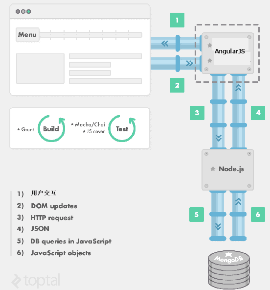

# 基础知识

## 名词解释

### IP

Internet Protocol，计算机间进行数据交换最简单的协议。也就是计算机网络互联进行通信而设计的协议，在因特网中，它能使连接到晚上所有计算机网络实现相互同i性能的一套规则，规定了计算机在因特网上进行通信时应当遵守的规则。

### URI

Uniform Resource Identifier，统一资源标识符。表示的是Internet上每一种可用的资源，如 HTML文档、图像、视频片段、程序等都由一个URI进行标识的。

### URL

Uniform Resource Locator，统一资源定位符。在WWW上，每一信息资源都有统一的且在网上唯一的地址，该地址就叫URL。它是WWW的统一资源定位标志，就是指网络地址。

### URN

Uniform Resource Name，统一资源名。每一个资源独立的名称。

### DNS

Domain Name System，域名系统。提供域名向IP转换的服务（把所有了解的域名换成对应的IP）。域名服务器是分层的，树状的结构如果当前DNS可以转换域名则返回结果，如果不行则向上层DNS发送请求。

### HTTP

Hypertext Transfer Protocol，超文本传输协议。通常运行在TCP之上。一种详细规定了浏览器和万维网服务器之间互相通信的规则，通过因特网传送万维网文档的数据传送协议。

### RFC

Request For Comments，是一系列以编号排定的文件。文件收集了有关互联网相关信息，以及UNIX和互联网社区的软件文件。目前RFC文件是由Internet Society（ISOC）赞助发行。基本的互联网通信协议都有在RFC文件内详细说明。

## HTTP

### Http1.1、/2、/3协议

| 对比项         | http1.1                                                      | http2                                                        | http3                                                        |
| -------------- | ------------------------------------------------------------ | ------------------------------------------------------------ | ------------------------------------------------------------ |
| **请求**       | 请求 Chrome有个机制，对于同一个域名，默认允许同时建立 6 个 TCP持久连接，在一个管道中同一时刻只能处理一个请求，在当前的请求没有结束之前，其他的请求只能处于阻塞状态 | 1.在应用层使用二进制分帧方式传输，服务器单位时间接收到的请求数变多，可以提高并发数，支持了多路复用； 2.多路复用，就是在一个 TCP 连接中可以存在多个流（流由帧组成），允许在一个连接上无限制并发流，因为请求在一个通道上，TCP 效率更高； 3.高优先级的请求会被优先处理 | 1.由于 QUIC 是基于 UDP 的，所以 QUIC 可以实现 0-RTT 或者 1-RTT 来建立连接，可以大大提升首次打开页面的速度； 2.集成了 TLS 1.3 加密，在完全握手情况下，需要 1-RTT 建立连接。 TLS1.3 恢复会话可以直接发送加密后的应用数据，不需要额外的 TLS 握手，也就是 0-RTT。 3.QUIC 是为多路复用从头设计的，携带个别流的的数据的包丢失时，通常只影响该流。 4.TCP 是按照四要素（客户端 IP、端口, 服务器 IP、端口）确定一个连接的。而 QUIC 则是让客户端生成一个 Connection ID （64 位）来区别不同连接。只要 Connection ID 不变，连接就不需要重新建立，即便是客户端的网络发生变化 |
| **头部**       | 由于报文Header一般会携带"User Agent""Cookie""Accept""Server"等许多固定的头字段（如下图），多达几百字节甚至上千字节，但Body却经常只有几十字节，一是增加传输成本，二是大量重复 | 第一次请求发送所有所需头部信息，后面每次请求和响应只发送差异头部，一般可以达到 50%~90% 的高压缩率 |                                                              |
| **安全性**     | 所有传输的内容都是明文，客户端和服务器端都无法验证对方的身份 | 支持使用 HTTPS 进行加密传输                                  | 支持使用 HTTPS 进行加密传输                                  |
| **服务端推送** | 不支持                                                       | 支持，在浏览器刚请求HTML的时候就提前把可能会用到的JS、CSS文件发给客户端，减少等待的延迟，这被称为"服务器推送" | 支持 ，基于TLS1.3                                            |
| **其他**       |                                                              | 1.TCP 以及 TCP+TLS 建立连接的延时； 2.TCP 的队头阻塞并没有彻底解决； 3.多路复用导致服务器压力上升； 4.多路复用容易 Timeout | 1.改进的拥塞控制、可靠传输，应用程序层面就能实现不同的拥塞控制算法； 2.单调递增的 Packet Number — 使用 Packet Number 代替了 TCP 的 seq，避免重传引起的二义性； 3.不允许 Reneging — 一个 Packet 只要被 Ack，就认为它一定被正确接收； 4.前向纠错（FEC）; 5.更多的 Ack 块和增加 Ack Delay 时间，在丢包率比较高的网络下，可以提升网络的恢复速度，减少重传量 |

### HTTPS和HTTP的区别

+ https协议需要到ca申请证书，一般免费证书很少，需要交费。
+ http是超文本传输协议，信息是明文传输，https 则是具有安全性的ssl加密传输协议。
+ http和https使用的是完全不同的连接方式，用的端口也不一样，前者是80，后者是443。
+ http的连接很简单，是无状态的；HTTPS协议是由SSL+HTTP协议构建的可进行加密传输、身份认证的网络协议，比http协议安全。

### 状态码

#### 1XX（临时响应）

表示临时响应并需要请求者继续执行操作的状态码。

| code            |                                                              |
| --------------- | ------------------------------------------------------------ |
| 100（继续）     | 请求者应当继续提出请求。服务器返回此代码表示：已经收到请求的第一部分，正在等待其余部分。 |
| 101（切换协议） | 请求者已要求服务器切换协议，服务器已确认并准备切换。         |

#### 2XX（成功）

表示成功处理了请求的状态码。

| code              |                                                              |
| ----------------- | ------------------------------------------------------------ |
| 200（成功）       | 服务器已成功处理了请求。通常，这表示服务器提供了请求的网页。如果是对您的robots.txt文件显示此状态码，则表示Googlebot已成功检索了该文件。 |
| 201（已创建）     | 请求成功并且服务器创建了新的资源。                           |
| 202（已接受）     | 服务器已接受请求，但尚未处理。                               |
| 203（非授权信息） | 服务器已成功处理了请求，但返回的信息可能来自另一来源。       |
| 204（无内容）     | 服务器成功处理了请求，但没有返回任何内容。                   |
| 205（重置内容）   | 服务器成功处理了请求，但没有返回任何内容。与204响应不同，此响应要求请求者重置文档视图（例如，清除表单内容以输入新内容）。 |
| 206（部分内容）   | 服务器成功处理了部分GET请求。                                |

#### 3XX（重定向）

要完成请求，需要进一步操作。通常，这些状态码用来重定向。Google建议您在每次请求中使用重定向不要超过5次。您可以使用网站管理员工具查看一下Googlebot在抓取重定向网页时是否遇到问题。诊断下的网络抓取页列出了由于重定向错误导致的Googlebot无法抓取的网址。

| code                |                                                              |
| ------------------- | ------------------------------------------------------------ |
| 300（多种选择）     | 针对请求，服务器可执行多种操作。服务器可根据请求者（user agent）选择一项操作，或提供操作列表供请求者选择。 |
| **301（永久移动）** | **请求的网页以永久移动到新的位置。服务器返回此响应（对Get或head请求的响应）时，会自动将请求者转到新位置。您应使用此代码告诉Googlebot某个网页或网站已永久移动到新位置。** |
| **302（临时移动）** | **服务器目前从不同位置的网页响应请求，但请求者应继续使用原有位置来响应以后的请求。此代码与响应get和head请求的301代码类似，会自动将请求者转到不同的位置，但您不应使用此代码来告诉Googlebot某个网页或网站已经移动，因为Googlebot会继续抓取原有位置并编制索引。** |
| 303（查看其它位置） | 请求者应当对不同的位置使用单独的GET请求来检索响应时，服务器返回此代码。对于除Head之外的所有请求，服务器会自动转到其它位置。 |
| 304（未修改）       | 自从上次请求后，请求的网页未修改过。服务器返回此响应时，不会返回网页内容。如果网页自请求者上次请求后也没有更改过，您应将服务器配置为返回此响应（成为If-Modified-Since HTTP标头）。服务器可以告诉Googlebot自从上次抓取后网页没有变更，进而节省带宽和开销。 |
| 305（使用代理）     | 请求者只能使用代理访问请求的网页。如果服务器返回此响应，还表示请求者应使用代理。 |
| 307（临时重定向）   | 服务器目前从不同位置的网页响应请求，但请求者继续使用原有位置来响应以后的请求。此代码与响应get和head请求的<a href = answer.py?answer=>301</a>代码类似，会自动将请求者转到不同的位置，但您不应使用此代码来告诉Googlebot某个页面或网站已经移动，因为Googlebot会继续抓取原有位置并编制。 |

#### 4XX（请求错误）

这些状态码表示请求可能出错，妨碍了服务器的处理。

| code                      |                                                              |
| ------------------------- | ------------------------------------------------------------ |
| 400（错误请求）           | 服务器不理解请求的语法。                                     |
| 401（未授权）             | 请求要求身份验证。对于登录后请求的网页，服务器可能返回此响应。 |
| 403（禁止）               | 服务器拒绝请求。如果您在Googlebot尝试抓取您网站上的有效网页时看到此状态码（您可以在Google网站管理员工具诊断下的网络抓取页面上看到此信息），可能是您的服务器或主机拒绝了Googlebot访问。 |
| **404（未找到）**         | **服务器找不到请求的网页。例如，对于服务器上不存在的网页经常会返回此代码。如果您的网站上没有robots.txt文件，而您在Googlebot网站管理员工具“诊断”标签的robots.txt页上看到此状态码，则这是正确的状态码。但是，如果您有robots.txt文件而又看到此状态码，则说明您的robots.txt文件可能命名错误或位于错误的位置（该文件应当位于顶级域，名为robots.txt）。如果对于Googlebot抓取的网址看到此状态码（在“诊断”标签的HTTP错误页面上），则表示Googlebot跟随的有可能是另一个页面的无效链接（是旧链接或输入有误的链接）。** |
| 405（方法禁用）           | 禁用请求中指定的方法。                                       |
| 406（不接受）             | 无法使用请求的内容特性响应请求的网页。                       |
| 407（需要代理授权）       | 此状态码与 <a href=answer.py?answer=35128>401（未授权）</a>类似，但指定请求者应当授权使用代理。如果服务器返回此响应，还表示请求者应当使用代理。 |
| 408（请求超时）           | 服务器等候请求时发生超时。                                   |
| 409（冲突）               | 服务器在完成请求时发生冲突。服务器必须在响应中包含有关冲突的信息。服务器在响应与前一个请求相冲突的 PUT 请求时可能会返回此代码，以及两个请求的差异列表。 |
| 410（已删除）             | 如果请求的资源已永久删除，服务器就会返回此响应。该代码与 404（未找到）代码类似，但在资源以前存在而现在不存在的情况下，有时会用来替代 404 代码。如果资源已永久移动，您应使用 301 指定资源的新位置。 |
| 411（需要有效长度）       | 服务器不接受不含有效内容长度标头字段的请求。                 |
| 412（未满足前提条件）     | 服务器未满足请求者在请求中设置的其中一个前提条件。           |
| 413（请求实体过大）       | 服务器无法处理请求，因为请求实体过大，超出服务器的处理能力。 |
| 414（请求的 URI 过长）    | 请求的 URI（通常为网址）过长，服务器无法处理。               |
| 415（不支持的媒体类型）   | 请求的格式不受请求页面的支持。                               |
| 416（请求范围不符合要求） | 如果页面无法提供请求的范围，则服务器会返回此状态码。         |
| 417（未满足期望值）       | 服务器未满足”期望”请求标头字段的要求。                       |

#### 5XX（服务器错误）

这些状态码表示服务器在处理请求时发生内部错误。这些错误可能是服务器本身的错误，文不是请求出错。

| code                    |                                                              |
| ----------------------- | ------------------------------------------------------------ |
| 500（服务器内部错误）   | 服务器遇到错误，无法完成请求。                               |
| 501（尚未实施）         | 服务器不具备完成请求的功能。例如，服务器无法识别请求方法时可能会返回此代码。 |
| 502（错误网关）         | 服务器作为网关或代理，从上游服务器收到无效响应。             |
| 503（服务不可用）       | 服务器目前无法使用（由于超载或停机维护）。通常，这只是暂停状态。 |
| 504（网关超时）         | 服务器作为网关或代理，但是没有及时从上游服务器收到请求。     |
| 505（HTTP版本不受支持） | 服务器不支持请求中的HTTP协议版本。                           |

## 网络编程相关

### 网络机器人

#### 定义

A Web crawler is a computer program that browses the World Wide Web in a methodical, automated manner.

## web

### Web的发展

#### web1.0

网络资源从信息产生着到信息客户的单向流程

#### web2.0

所有人既是网络资源的信息生产者又是信息客户

#### web3.0

智能语义程序接入网络资源流程，更有针对性的发送信息和获得信息

### MEAN

####  概述

+ MEAN是⼀个Javascript平台的现代Web开发框架总称
  + MongoDB是⼀个使⽤JSON⻛格存储的数据库，⾮常适合javascript。(JSON是JS数据格式)
  + ExpressJS是⼀个Web应⽤框架，提供有帮助的组件和模块帮助建⽴⼀个⽹站应⽤。
  + AngularJS是⼀个前端MVC框架。
  + Node.js是⼀个并发 异步 事件驱动的Javascript服务器后端开发平台。

#### 架构原理

