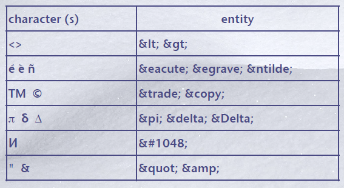
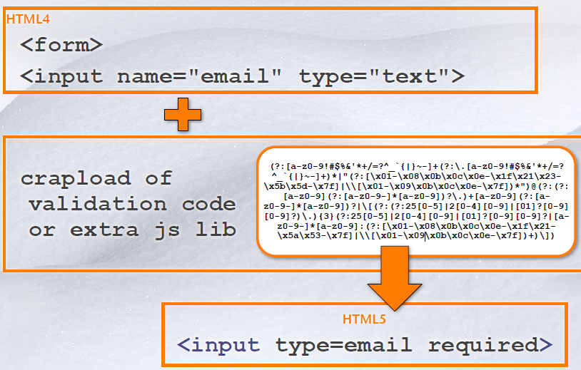
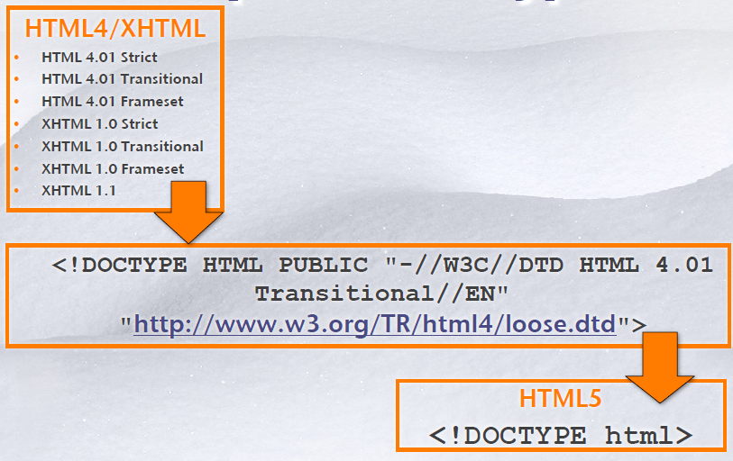
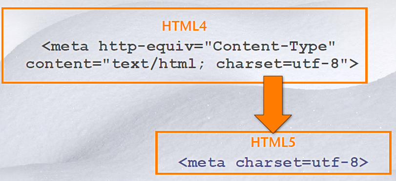
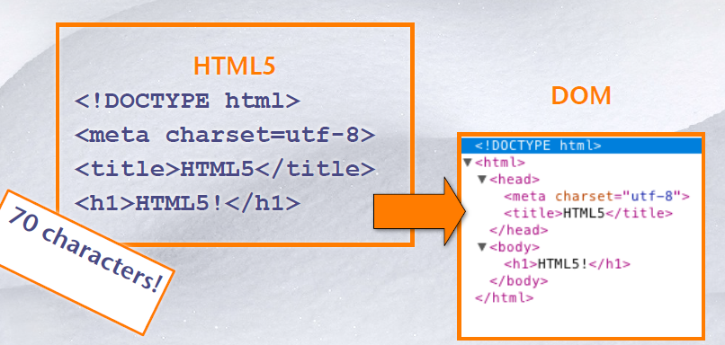
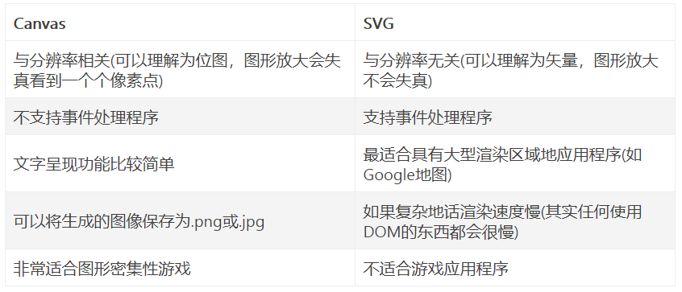
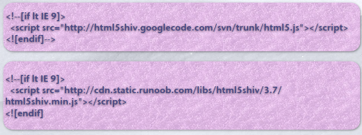

# HTML/XHTML

## 名词解释

### HTML

Hypertext Markup Language，超文本标记语言。是用于描述网页文档的一种标记语言，浏览器根据html创建web页面与web应用。

### SGML

Standard Generalized Markup Language，标准通用标记语言。是一种非常弹性的标记语言，是一种定义电子文档结构和描述其内容的国际标准语言。

### XHTML

eXtensible HyperText Markup Language，可扩展超文本标识语言。HTML是一种基于标准通用标记语言（SGML）的应用，是一种非常灵活的置标语言，而XHTML则基于可扩展标记语言（XML），XML是SGML的一个子集。

### Markup

标记，将代码嵌入到文本中，代码叫做tag。代码用来表示结构化文本并包含运行指令

### Markup language

标记语言，是一种将文本以及文本相关的其他信息结合起来，展现出关于文档结构和数据处理细节的电脑文字编码。可以使用其他工具进行特定的渲染。

### Logical Markup

逻辑标记。用来形容一部分文档的，与渲染无关。例如：\<strong>very\</strong>表示在文档中very很重要

### Markdown 

是⼀种轻量级标记语⾔，它允许⼈们使⽤易读易写的纯⽂本格式编写⽂档。编写的⽂档可以导出 HTML 、Word、图像、PDF、Epub 等多种格式的⽂档。编写的⽂档后缀为 .md, .markdown。

## HTML基础

### 结构

#### \<DOCTYPE>

+ 定义当前使用的文档类型（DTD）

#### \<Head>

+ 定义mata标签
+ 只用\<title>是必须的

##### \<title>

+ 放在页面头部
+ 浏览器的标题栏显示及书签页显示

##### \<meta>

+ 放在页面头部
+ 元素可提供有关页面的元信息（meta-information），比如针对搜索引擎和更新频度的描述和关键词。
+ \<meta http-equiv="Content-Type" content="text/html; charset=gbk" />

#### \<Body>

+ 渲染的代码

### 块级元素

+ 包含一个完整内容的区域，例如：段落、列表、表格
+ 浏览器会为每一个块级元素之间进行留白，作为区分

#### \<p>

+ body中的页面段落

#### \<table>

+ 表格
+ 不要使用table作为布局
  + table比其它html标记占更多的字节。(造成下载时间延迟,占用服务器更多流量资源)
  + table会阻挡浏览器渲染引擎的渲染顺序。(会延迟页面的生成速度,让用户等待更久的时间)
  + table里显示图片时需要你把单个、有逻辑性的图片切成多个图。(增加设计的复杂度,增加页面加载时间,增加http会话数)
  + 在某些浏览器中,table里的文字的拷贝会出现问题。(会让用户不悦)
  + table会影响其内部的某些布局属性的生效(比如\<td>里的元素的height:100%) (限制页面设计的自由性)
  + 一旦学了CSS的知识,你会发现使用table做页面布局会变得更麻烦。(先花时间学一些CSS知识,会省去你以后大量的时间)
  + ‘table对’对于页面布局来说,从语义上看是不正确的。(它描述的是表现,而不是内容)
  + table代码会让阅读者抓狂。(不但无法利用CSS,而且会不知所云,尤其在进行页面改版或内容抽取的时候)
  + table一旦设计完成就变成死的,很难通过CSS让它展现新的面貌。(CSS ZEN GARDEN:http://www.csszengarden.com/)

#### \<blockquote>

+ 引用

### 内联元素

+ 影响小部分内容，例如：粗体字、代码段、图片
+ 浏览器允许许多内联元素出现在同一行
+ 必须被嵌入在块级元素里面

#### \<br>

+ 文章中的换行符

+ 格式只有\<br/>

#### \<a>

+ 锚点
+ 浏览器中的hover

#### \

+ 插入图片
+ XHTML也需要alt属性来形容图片（alt在图片无法显示时的代替文本）

#### \<em>、\<strong>

+ \<em>强调文本（使用斜体字）

+ \<strong>特别强调文本（使用粗体字）

+ 不要随意嵌套，在XHTML可能报错

  \<p>HTML is \<em>really,\<strong>REALLY\</em> lots of \</strong> fun!\</p>

#### \<q>

+ 内部短引用，显示：“aaa”
+ XHTML不包含文字性的引用标记，而且使用\<q>可以用CSS属性

### 注释

+ \<!--...-->

+ 注释不能被嵌套也不能只包含一个-

### 字符实体



## 表单

### 介绍

+ 用来获取用户输入

+ \<form arguments> ... \</form>

+ 参数有

  + action="url"（必须）：指定数据去向
  + method="get"：用get将数据包含在url传送
  + method="post"：将数据送到url request
  + target="target"：说明在submit后的跳转

### \<input>

+ type属性：text, checkbox, radio, password, hidden, submit, reset, button, file, or image
+ hidden
  + 所有input的field会被送回去服务器端，包含hidden field。
  + 这是一个方法可以包含用户看不到的信息

### 表单验证

#### valueMissing

目的：确保表单控件中的值已填写。

用法：在表单控件中将required特性设置为true。

示例：

```
<input type="text" name="myText" required>
```

详细说明：如果表单控件设置了required特性，那么在用户填写或者通过代码调用方式填值之前，控件会一直处于无效状态。例如，空的文本输入框无法通过必填检查，除非在其中输入任意文本。输入值为空时，valueMissing会返回true。

#### typeMismatch

目的：保证控件值与预期类型相匹配(如numbe、email、URL等).

用法：指定表单控件的type特性值。

示例：

```
<input type="email" name="myEmail">
```

详细说明：特殊的表单控件类型不只是用来定制手机键盘， 如果浏览器能够识别出来表单控件中的输入不符合对应的类型规则，比如email地址中没有@符号，或者number型控件的输入值不是有效的数字，那么浏 览器就会把这个控件标记出来以提示类型不匹配。无论哪种出错情况，typeMismatch将返回true。

#### patternMismatch

目的：根据表单控件上设置的格式规则验证输入是否为有效格式。

用法：在表单控件上设置pattern特性，井赋予适当的匹配规则。

示例：

```
<input type="text" name="creditcardnumber" pattern="[0-9]{16}" title="A credit
card number is 16 digits with no spaces or dashes">
```

详细说明：pattern特性向开发人员提供了一种强大而灵活的方式来为表单的控件值设定正则表达式验证机制。当为控件设置了pattern特性 后，只要 输入控件的值不符合模式规则，patternMismatch就会返回true值。从引导用户和技术参考两方面考虑，你应该在包含pattern特性的表 单控件中设置title特性以说明规则的作用。

#### tooLong

目的：避免输入值包含过多字符。

用法：在表单控件上设置maxLength特性。

示例：

```
<input type="text" name="limitedText" maxLength="140">
```

详细说明：如果输入值的长度超过maxLength， tooLong特性会返回true。虽然表单控件通常会在用户输入时限制最大长度，但在有些情况下，如通过程序设置，还是会超出最大值。

#### rangeUnderflow

目的：限制数值型控件的最小值。

用法：为表单控件设置min特性，并赋予允许的最小值。

示例：

```
<input type="range" name="ageCheck" min="18">
```

详细说明：在需要做数值范围检查的表单控件中，数值很可能会暂时低于设置的下限。此时，ValidityState的rangeUnderflow特性将返回true。

#### rangeOverflow

目的：限制数值型控件的最大值。

用法：为表单控件设置max特性，并赋予允许的最大值。

示例：

```
<input type="range" name="kidAgeCheck" max="12">
```

详细说明：与rangeUnderflow类似，如果一个表单控件的值比max更大，特性将返回true。

#### stepMismatch

目的：确保输入值符合min、max及step即设置。

用法：为表单控件设置step特性，指定数值的增量。

示例：

```
<input type="range" name="confidenceLevel" min="0" max="100" step="5">
```

详细说明：此约束条件用来保证数值符合min、max和step的要求。换句话说，当前值必须是最小值与step特性值的倍数之和。例如，范围从0到100，step特性值为5，此时就不允许出现17，否则stepMismatch返回true值。

#### customError

目的：处理应用代码明确设置及计算产生的错误。

用法：调用setCustomValidity(message)将表单控件置于customError状态。

示例：

```
passwordConfirmationField.setCustomValidity("Password values do not match.");
```

详细说明：浏览器内置的验证机制不适用时，需要显示自定义验证错误信息。当输入值不符合语义规则时，应用程序代码应设置这些自定义验证消息。

## web标准

### XHTML和web标准

+ 更加严格与结构化的语言
+ 我们未来页面展示的正确性
+ 可以被其他渲染语言如：XML、SVG改变

## HTML5

### 简介

+ HTML5 是下⼀代 HTML 标准。
+ HTML , HTML 4.01的上⼀个版本诞⽣于 1999年。⾃从那以后，Web 世界已经经历了巨变。
+ HTML5 仍处于完善之中。然⽽，⼤部分现代浏览器已经具备了某些 HTML5 ⽀持。

### 特性

#### Paves the Cow Paths



#### 简化DOCTYPE



#### 简化character set



#### 简化markup



#### 包容性更佳

+ 可兼容其他语言


#### 减少插件

+ HTML5提供audio、video、drawing、sockets的原生支持，减少了插件的使用
+ 插件被移除或是不需要下载

#### 安全性

+ HTML5使用原生的安全防护

### 改进

#### 新的API

(Application Programming Interface)--应用程序编程接口

- HTML Geolocation 地理位置
- HTML Drag & Drop拖放
- HTML Local Storage 本地存储
- HTML Application Cache 应用程序缓存
- HTML Web Workers web工作者
- HTNL SSE

#### 新的元素

+ 能使⽤CSS替代的元素

  + basefont，center，font，tt，u
+ 不再使⽤frame框架
+ 只有部分浏览器⽀持的元素
    + applet，bgsound，marquee
+ 其他被废除的元素
    + isindex，dir，rb等

#### 语义化

+ 根据结构化的内容选择合适的标签
+ 有利于SEO
+ 开发维护体验好
+ ⽤户体验更好
+ 更好的可访问性，⽅便任何设备对代码进⾏解析

#### 使用结构化、语义化标签

+ 定义方法区域、使用结构化标签
+ 将style移到CSS文件
+ 使用stylesheet
+ 考虑布局的网格系统

#### Microdata

+ 强调机器阅读性
+ 可与其他格式数据比较，例如：RDF、JSON


#### 表格

+ 不要求一定要JavaScript
+ 增加原生数据和颜色选择
+ 增加Search, e-mail, web address类型
+ 增加客户端的报错
+ 旧浏览器中新的表单控件会平滑降级

#### Audio and Video

+ 新标签\<audio> and \<video>
+ 原生的标签，不需导入插件，也可以被CSS和JavaScript修改

#### Canvas and SVG

+ 提供原生的绘画模块
+ 可以被CSS和JavaScript修改



#### web存储

+ HTML5 web存储,⼀个⽐cookie更好的本地存储⽅式。
+ 客户端存储数据的两个对象为：
  + localStorage - ⽤于⻓久保存整个⽹站的数据，保存的数据没有过期时间，直到⼿动去除。
  + sessionStorage - ⽤于临时保存同⼀窗⼝(或标签⻚)的数据，在关闭窗⼝或标签⻚之后将会删除这些数据。

+ HTML5 引⼊了应⽤程序缓存，这意味着 web 应⽤可进⾏缓存，并可在没有因特⽹连接时进⾏访问。

+ 应⽤程序缓存为应⽤带来三个优势：
  + 离线浏览 - ⽤户可在应⽤离线时使⽤它们
  + 速度 - 已缓存资源加载得更快
  + 减少服务器负载 - 浏览器将只从服务器下载更新过或更改过的资源。

+ ⼀旦应⽤被缓存，它就会保持缓存直到发⽣下列情况：
  + ⽤户清空浏览器缓存
  + manifest ⽂件被修改
  + 由程序来更新应⽤缓存

#### Web Workers

+ 当在 HTML ⻚⾯中执⾏脚本时，⻚⾯的状态是不可响应的，直到脚本已完成。
+ web worker 是运⾏在后台的 JavaScript，独⽴于其他脚本，不会影响⻚⾯的性能。可以继续做任何愿意做的事情：点击、选取内容等等，⽽此时 web worker 在后台运⾏。

#### Enabling JavaScript

+ 使⽤ Sjoerd Visscher 创建的 "HTML5 Enabling JavaScript", " shiv" 来解决该问题:

