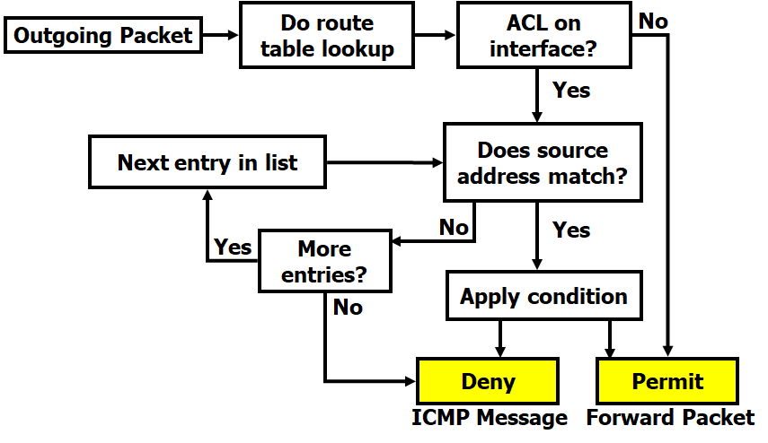

# Network Security

## 网络安全问题概述

### 威胁

#### 类型

+ 截获——从网络上窃听他人的通信内容。

+ 中断——有意中断他人在网络上的通信。

+ 篡改——故意篡改网络上传送的报文。

+ 伪造——伪造信息在网络上传送。

### 攻击

#### 被动

+ 截获信息的攻击称为被动攻击

+ 在被动攻击中，攻击者只是观察和分析某一个协议数据单元 PDU 而不干扰信息流。

#### 主动

+ 更改信息和拒绝用户使用资源的攻击称为主动攻击

+ 主动攻击是指攻击者对某个连接中通过的 PDU 进行各种处理。
  + 更改报文流 
  + 拒绝报文服务 
  + 伪造连接初始化 

### 程序

#### 恶意程序

+ 计算机病毒——会“传染”其他程序的程序，“传染”通过修改其他程序来把自身或其变种复制进去而完成。

+ 计算机蠕虫——通过网络的通信功能将自身从一个结点发送到另一个结点并启动运行的程序。

+ 特洛伊木马——一种程序，它执行的功能超出所声称的功能。

+ 逻辑炸弹——一种当运行环境满足某种特定条件时执行其他特殊功能的程序。 

### 网络安全

#### 目标

+ 防止析出报文内容

+ 防止通信量分析

+ 检测更改报文流

+ 检测拒绝报文服务
+ 检测伪造初始化连接

#### 功能

+ 保密性（ Confidentiality）

+ 完整性（Integrity）
  + 数据完整性，未被非授权篡改或者损坏
  + 系统完整性，系统未被非授权操纵，按既定的功能运行

+ 可用性（Availability）

+ 鉴别（Authenticity）
  + 实体身份的鉴别，适用于用户、进程、系统、信息等
+ 不可否认性（ Non-repudiation）
  + 防止源点或终点的抵赖

## 一般的数据加密模型

### 介绍

#### 图示

#### 概念

+ 密码编码学(cryptography)是密码体制的设计学，而密码分析学(cryptanalysis)则是在未知密钥的情况下从密文推演出明文或密钥的技术。密码编码学与密码分析学合起来即为密码学(cryptology)。

+ 如果不论截取者获得了多少密文，但在密文中都没有足够的信息来唯一地确定出对应的明文，则这一密码体制称为无条件安全的，或称为理论上是不可破的。

+ 如果密码体制中的密码不能被可使用的计算资源破译，则这一密码体制称为在计算上是安全的。 

## 对称密钥和公钥密码体制

### 对称密钥

#### 简介

+ 所谓常规密钥密码体制，即加密密钥与解密密钥是相同的密码体制。

#### DES

+ Data Encryption Standard：数据加密标准；是一种使用密钥加密的块算法。
+ 数据加密标准 DES 属于常规密钥密码体制，是一种分组密码。

+ 在加密前，先对整个明文进行分组。每一个组长为 64 位。

+ 然后对每一个 64 位 二进制数据进行加密处理，产生一组 64 位密文数据。

+ 最后将各组密文串接起来，即得出整个的密文。

+ 使用的密钥为 64 位（实际密钥长度为 56 位，有 8 位用于奇偶校验)。 

#### DES保密性

+ DES 的保密性仅取决于对密钥的保密，而算法是公开的。尽管人们在破译 DES 方面取得了许多进展，但至今仍未能找到比穷举搜索密钥更有效的方法。

+ DES 是世界上第一个公认的实用密码算法标准，它曾对密码学的发展做出了重大贡献。

+ 目前较为严重的问题是 DES 的密钥的长度。

+ 现在已经设计出来搜索 DES 密钥的专用芯片。  

### 公钥密码体制

#### 简介

+ 公钥密码体制使用不同的加密密钥与解密密钥，是一种“由已知加密密钥推导出解密密钥在计算上是不可行的”密码体制。 

+ 公钥密码体制的产生主要是因为两个方面的原因，一是由于常规密钥密码体制的密钥分配问题，另一是由于对数字签名的需求。

+ 在公钥密码体制中，加密密钥(即公钥) *PK* 是公开信息，而解密密钥(即私钥或秘钥) *SK* 是需要保密的

+ 加密算法 *E* 和解密算法 *D* 也都是公开的

+ 虽然*SK* 是由*PK* 决定的，但却不能根据 *PK* 计算出 *SK* 

#### 特点

+ 发送者 A 用 B 的公钥 *PK*B 对明文 *X* 加密（*E* 运算）后，在接收者 B 用自己的私钥 *SK*B 解密（*D* 运算），即可恢复出明文：

+ 解密密钥是接收者专用的秘钥，对其他人都保密。

+ 加密密钥是公开的，但不能用它来解密，即

+ 加密和解密的运算可以对调，即

+ 在计算机上可容易地产生成对的 *PK* 和 *SK*。

+ 从已知的 *PK* 实际上不可能推导出 *SK*，即从 *PK* 到 *SK* 是“计算上不可能的”。

+ 加密和解密算法都是公开的。

## 数字签名

### 介绍

#### 名词解释

+ DSS；Digital Signature Standard；数字签名标准；美国政府用来指定数字签名算法的一种标准。

+ DSA；Digital Signature Algorithm；数字签名算法；是数字签名标准的一个子集，表示了只用作数字签名的一个特定的公钥算法。

#### 简介

+ 报文鉴别——接收者能够核实发送者对报文的签名

+ 报文的完整性——发送者事后不能抵赖对报文的签名

+ 不可否认——接收者不能伪造对报文的签名

#### 实现

+ 因为除 A 外没有别人能具有 A 的私钥，所以除 A 外没有别人能产生这个密文。因此 B 相信报文 *X* 是 A 签名发送的。

+ 若 A 要抵赖曾发送报文给 B，B 可将明文和对应的密文出示给第三者。第三者很容易用 A 的公钥去证实 A 确实发送 *X* 给 B。

+ 反之，若 B 将 *X* 伪造成 *X*‘，则 B 不能在第三者前出示对应的密文。这样就证明了 B 伪造了报文。 

## 防火墙

### 防火墙

#### 介绍

+ 防火墙是由软件、硬件构成的系统，是一种特殊编程的路由器，用来在两个网络之间实施接入控制策略。防火墙内的网络称为“可信赖的网络”(trusted network)，而将外部的因特网称为“不可信赖的网络”(untrusted network)。

#### 功能

+ “阻止”就是阻止某种类型的通信量通过防火墙（从外部网络到内部网络，或反过来）。
+ “允许”的功能与“阻止”恰好相反。
+ 防火墙必须能够识别通信量的各种类型。不过在大多数情况下防火墙的主要功能是“阻止”。

#### 类型

+ 网络级防火墙——用来防止整个网络出现外来非法的入侵。属于这类的有**分组过滤**和**授权服务器**
  + 前者检查所有流入本网络的信息，然后拒绝不符合事先制订好的一套准则的数据
  + 后者则检查用户的登录是否合法

+ 应用级防火墙——从应用程序来进行接入控制。通常使用应用网关或代理服务器来区分各种应用
  + 例如，可以只允许通过访问万维网的应用，而阻止 FTP 应用通过

### 访问控制列表ACL

#### 介绍

+ Access Control List；访问控制列表；是路由器和交换机接口的指令列表，用来控制端口进出的数据包。
+ 在路由器设置，让路由器决定包的转发或丢弃。

+ Wildcard Mask（通配符掩码）表示地址中的某位需要匹配还是忽略。0表示匹配，1表示忽略。

#### 过程

#### 放置

+ 标准ACL应该尽可能放在离目的端近的位置；

+ 扩展ACL应该尽可能放在离源端近的位置。