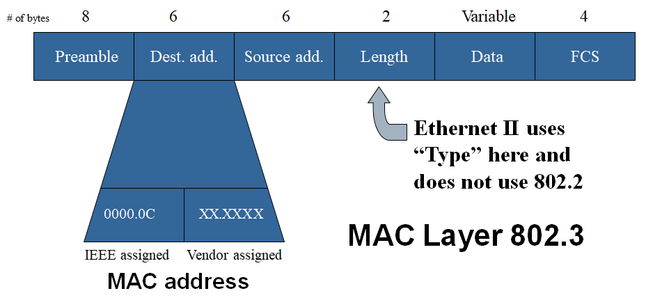
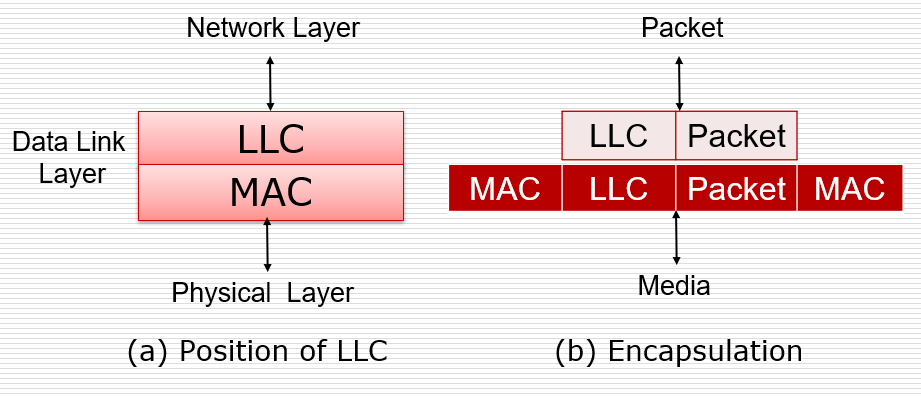
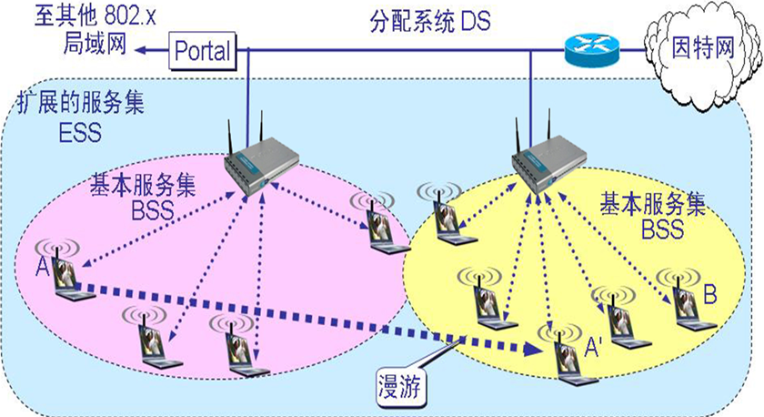
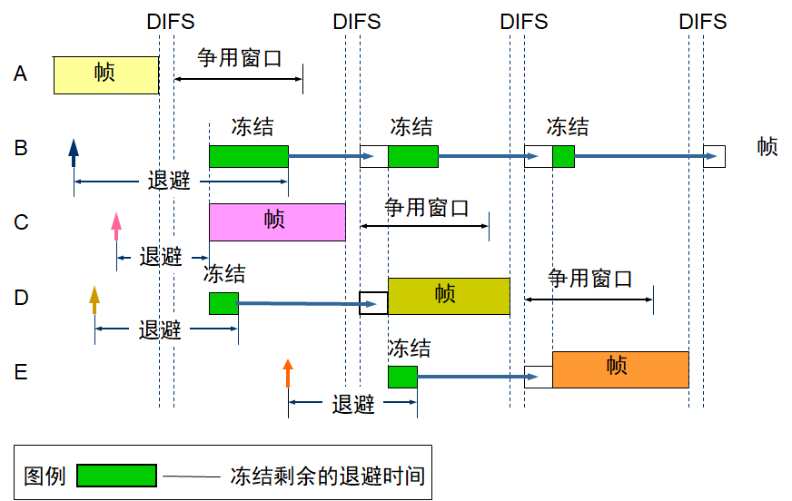
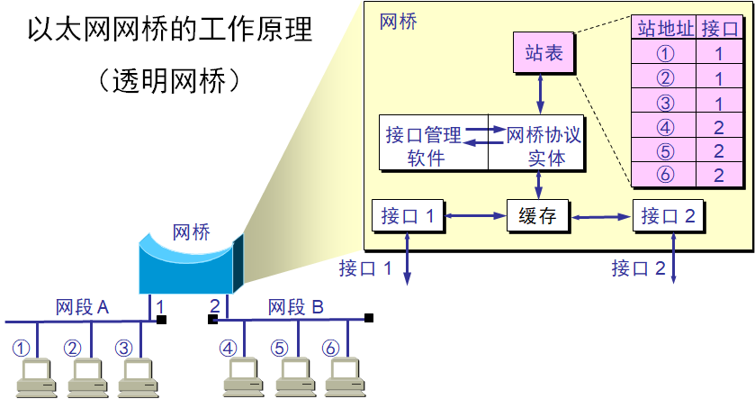

# Data Link Layer

## Overview of the Data Link Layer

### Data Link Layer

#### 名词解释

+ Node：节点，网络中的主机和路由器
+ Link：链路，邻接节点间的通道(channel)
+ LLC - Logical Link Control：逻辑链路控制。LLC负责识别网络层协议，然后对它们进行封装。LLC报头告诉数据链路层一旦帧被接收到时，应当对数据包做何处理。
+ MAC - Media Access Control：介质访问控制
+ FDDI - Fiber Distributed Data Interface：光纤分布式数据接口，它是一项局域网数据传输标准
+ CSMA/CD - Carrier Sense Multiple Access with Collision Detection ，带冲突检测的载波侦听多路接入
  + CSMA：先侦听线路，如果发现空闲，则发送数据，否则等待 。
  + CD：在传输过程中，仍然侦听线路，如果冲突检测到，则先广播拥塞信号，后退算法决定哪个设备再次接入介质。

#### 简介

+ 物理逻辑层无逻辑，不能判断数据对错
+ 提供了
  * 对介质的访问
  * 提供通过介质进行的物理传输
+ 第二层协议定义了
  * 在线路上交换的数据的格式
  * 节点的行为

+ 主要目标
  * 错误通知
  * 流控制(Flow Control)
  * 网络拓扑
  * 物理寻址
  * 网络接入/访问(Network Access)
  * 帧有序传递(Ordered Frame Transmission)
+ 这一层中，“过程(procedure)" = "协议(protocol)"

#### 第二层 V.S. 第一层

| 第一层                                   | 第二层                   |
| ---------------------------------------- | ------------------------ |
| 无法与上层通信                           | 通过LLC与上层通信        |
| 无法确定哪台主机将会传输或接受二进制数据 | 通过MAC确定              |
| 无法命名或标识主机                       | 通过寻址或命名过程来实现 |
| 仅仅能描述比特流                         | 通过帧来组织/分组比特    |

#### 第二层服务（LLC服务）

+ 无应答的无连接服务
  + 通讯前不做连接，通讯中不做响应
  + 用于
    + 可靠连接
    + 大部分局域网
+ 带应答的无连接服务
  + 有确认，不做连接
  + 低效率
  + 损失带宽性能
+ 带应答的面向连接服务
  + 用于蓝牙连接

#### LAN的MAC（介质访问控制）

+ 以太网：逻辑总线拓扑，物理星形或扩展星形拓扑 。
+ 令牌环：逻辑环形拓扑，物理星形拓扑。
+ FDDI：逻辑环形拓扑， 物理双环形拓扑

#### MAC访问方法

+ 决定性
  + 轮流
  + 令牌环和FDDI
+ 非决定性
  + 先来先服务
  + 以太网

#### 传输方式

- unicast：单点传输
  - 单一个包从源发送至网络中唯一一个节点
- multicast：组播
  - 单一个包发送至网络中多个节点
- broadcast：广播
  - 单一个包发送至网络中所有节点

## Ethernet and CSMA/CD

### LAN标准

#### 简介

- 定义物理介质和连接至介质的连接器
- 定义设备在数据链路层进行通信的方式
- 数据链路层定义数据如何在物理介质上进行传输
- 数据链路层定义如何封装不同上层协议的流量，使得不同协议的流量可以使用同样的通道到达协议栈上层

#### 分类

- 将数字链路层划分为两个子层(IEEE标准，和OSI的有一些不同)
  - MAC(802.3, 802.5): Media Access Control，介质访问控制子层，与下层通信
    - 实际上是跨第一层和第二层的接口
    - 是围绕特定技术构建的
  - LLC(802.2): Logical Link Control，逻辑链路控制子层，与上层通信
    - 可以独立工作，与已有的技术隔离。单一的LLC可以与不同的MAC兼容


### MAC子层

#### 报文格式

+ 常用的以太网MAC 帧格式有两种标准，一种是DIX Ethernet V2 标准(即以太网V2标准)，另一种是IEEE的802.3标准



#### 各段介绍

+ Preamble：前导码
  + 用来提示接受者一个帧正在到来。
  + 给接收方一个缓冲，使时钟同步。
  + 10101010 \* 7 + 10101011 \* 1

+ Destination Address：目标地址
  + 在单播、组播（逻辑地址）、广播（逻辑地址，6地址全1）时有不同的格式。
  + MAC地址
  + 网桥或交换机是基于MAC Table做转发的
  + 目标地址与源地址顺序和其他层不同

+ Source Address：源地址
  + 始终是单播格式的地址。

+ Length：长度

  + 指示数据的字节数。以太网中46 - 1500。

  + 不小于46是为了帧总长度不小于64，以保证有足够的传输时间用于以太网卡精确的检测冲突，这一时间是根据网络的最大电缆长度和帧沿电缆传输所要的时间来决定的。
  + 不大于1500是因为1500字节是以太网最大传输单元(Maximum Transmission Unit)
  + 所以，802.3帧大小在46 - 1500字节之间。
  + 如果不足46字节则补零

+ FCS Frame Check Sequence：帧校验序列
  + CRC值
  + 发送：有效帧数百分数 = FCS，接受：检验是不是一致

### LLC子层

#### 封装

* 维护单一链路上设备间的通信
* 使用SAP(Service Access Point，服务访问点)在逻辑上标识不同的(上层)协议种类并且封装它们

  - 添加两个寻址部分来标识每个端点(end)的上层协议

    - DSAP - Destination Service Access Point：目标服务访问点
    - SSAP - Source Service Access Point：源服务访问点

  - LLC帧类型依赖于上层协议期望什么标识符(identifier)



### 以太网

#### MAC地址

+ OUI - Organizational Unique Identifier：组织唯一标识符
  + 向IEEE申请
  + MAC地址前3字节
+ 第一位
  + 0：单播
  + 1：多播
+ 第二位
  + 0：全球唯一地址
  + 1：本地唯一地址

#### 广播

+ MAC目的地址全1（FFFF.FFFF.FFFF）
+ 用途
  + 目的地址未知
  + 目的是全部节点

#### 传输

+ 以太网是广播网络
  + 每个节点都能看到所有帧（发送的数据）。
  + 是否接受由帧头的Destination Address和本机MAC地址决定。

#### 冲突解决

+ 使用CSMA/CD介质访问控制方式

```flow
st0=>start: 开始
st1=>operation: 主机有数据要传输
testSensed=>condition: 载波是否空闲
asm=>operation: 组帧
trans=>operation: 开始传输
testCollision=>condition: 是否发生冲突
keep=>operation: 继续传输
testComplete=>condition: 是否传输完成
complete=>end: 传输完成
jam=>operation: 广播JAM信号
atpAcc=>operation: 尝试次数计数器自增
testAtpOverflow=>condition: 是否尝试过多(16次)
abort=>end: 放弃传输(告诉上层网络网络不稳定)
backoff=>operation: 根据算法计算推迟时间t
wait=>operation: 等待t秒
st0->st1->testSensed
testSensed(yes)->asm
testSensed(no)->st1
asm->trans->testCollision
testCollision(yes)->jam->atpAcc->testAtpOverflow
testAtpOverflow(yes)->abort
testAtpOverflow(no)->backoff->wait->trans
testCollision(no)->keep->testComplete
testComplete(yes)->complete
testComplete(no)->keep
```

## Wireless LAN and CSMA/CA

### Wireless LAN

#### 介绍

* 基于蜂窝状网络通信
* 近距离传输

#### 分类

+ IEEE 802.11

+ IEEE 802.11b

+ IEEE 802.11a

+ IEEE 802.11g

+ IEEE 802.11n

### Wireless LAN标准

#### 802.11

* DSSS - Direct Sequence Spread Spectru：直接序列扩频。关键技术
* 带宽1 ~ 2 Mbps
* DSSS可以最高工作在11 Mbps，但是2 Mbps上就不稳定了

#### 802.11b

* 大名鼎鼎的Wi-Fi
* 通过使用与802.11不同的编码方式，将传输能力提高到11 Mbps
* 向后兼容802.11
* 工作在2.4GHz
* 优化：高速直连

#### 802.11a

* 5GHz
* 54 Mbps，利用速率倍增技术(rate doubling)可以达到108 Mbps
* 实际使用中，一般在20-26 Mbps
* 优点：可用户很多

* 缺点：信号衰减快

#### 802.11g

* 速率与802.11a一样，不过向后兼容了802.11b
* 使用了OFDM(Orthogonal Frequency Division Multiplexing，正交频分复用)技术

#### 802.11n

+ next generation WLAN

* 提供双倍于802.11g的带宽，即108 Mbps，理论上可以达到500 ~ 600 Mbps

#### 拓扑

+ Infrastructure mode 



+ ad-hoc mode

#### BSS

+ Basic Service Set，基础服务集

* 包括基站(Base Station)和许多无线主机
* 在同一个BSS中的主机间直接通信
* BSS可以通过DS(Distribution System，分布式系统)连接至另一个BSS，构成一个ESS(Extended Service Set，拓展服务集)

#### AP

+ Access Point，接入点

* 基础模式下，AP和BS作用一样
* AP用有线方式连接到LAN以获得互联网接入
* AP拥有自己的SSID(Service Set Identifier，服务集标识)和信道
* 范围300 ~ 500英尺

### scanning 扫描

#### 名词解释

+ SSID - Service Set Identifier：服务集标识

#### Active Scanning 主动扫描

* 主机（客户端）主动发出一个包含了AP的SSID的探测请求(probe request)，当具有这个SSID的AP接受到这个请求后，会发布一个探测回复(probe response)。主机接受到回复之后开始完成认证和连接过程。

#### Passive Scanning 被动扫描

* 主机监听AP(在基础模式下)或对等节点(peer node)(在点对点模式下)发出的信标管理帧，一旦收到，主机开始尝试加入网络的过程。
* 被动扫描会一直持续。连接也会随着AP信号的强弱变化建立或断开

### Frame 帧

#### 介绍

+ WLAN中不使用标准的802.3帧

+ 控制帧

  * RTS, CTS, ACK

+ 管理帧

+ 数据帧

  + 只有数据帧类似802.3帧

+ 管理帧和数据帧有自己独特的帧格式。

+ 数据帧最大可以到2346字节，载荷2328字节。

  + 不过通常仍然限制到1518字节，因为通常WLAN是连接到Ethernet的。

  + 有确认的通讯方式，速率下降
  + 增加帧的数据量，速率上升

#### 帧格式


+ 序号控制：确认
+ 地址4：自组网地址
+ AP - Access Point：接入点
+ 当站点A 把数据帧发送给AP时，帧控制宇段中的"到DS = 1" 而"从DS = 0"。
  + 地址1 是AP的MAC 地址1( 接收地址)，地址2 是A 的MAC 地址(源地址)，地址3 是B 的MAC 地址(目的地址)。请注意，"接收地址"与"目的地址"并不等同。
+ 当AP把数据帧发送给站点B 时，帧控制宇段中的"到DS = 0" 而"从DS = 1"。
  + 因此地址1 是B 的MAC 地址(目的地址)，地址2 是AP的MAC 地址(发送地址)，地址3 是A 的MAC 地址(源地址)。请注意，上述的"发送地址"与"源地址"也不相同。
+ AP 的MAC 地址在802.11 标准中叫做基本服务集标识符BSSID. 也是一个6 字节(48 位)地址。和以太网地址相似，对于单-全球管理的地址，其第1 字节的最低位是O 而最低第2 位是1。

+ 站点 A 向 B 发送数据帧。数据帧必须经过 AP 转发

### CSMA/CA

#### 名词解释

+ CSMA/CA - Carrier Sense Multiple Access with Collision Avoidance：带冲突避免的载波侦听多路接入
+ RTS - Request To Send：请求传输帧
+ CTS - Clear To Send：清除传输帧
+ ACK - acknowledgment
+ DIFS - Distributed Inter-frame Spacing：分布式帧间间隙，在CSMA/CA中，媒体空闲，站点就在等待一个设定的时间即DIFS。

#### 解决问题

* 隐藏站点问题(Hidden Station Problem)
  * A在向B传输时，C无法检测到这一传输，所以C可能会决定发起传输，这将导致冲突
* 暴露站点问题(Exposed Station Problem)
  * A在向B传输时，C检测到这一传输，所以C将不会向D发起传输，这会造成不必要的浪费

| Ethernet                             | WLAN                                          |
| ------------------------------------ | --------------------------------------------- |
| 信号被传输到连接在线缆上的所有站点上 | 信号只被传输到接近发送站点的站点              |
|                                      | 接受站点检测冲突                              |
| 只会有一个有效帧在信道上传播         | 会有多个有效帧同时在信道上传播                |
|                                      | MAC协议必须尽可能保证只有发送站点接近接收站点 |

#### 过程

+ A向B发送RTS（Request To Send）帧，A周围的站点在一定时间内不发送数据，以保证CTS帧返回给A；

+ B向A回答CTS（Clear To Send）帧，B周围的站点在一定时间内不发送数据，以保证A发送完数据；

+ A开始发送

+ 若控制帧RTS或CTS发生冲突，采用二进制指数后退算法等待随机时间，再重新开始。
+ 冻结时间根据回退算法决定



#### 实际吞吐量

* 因为源站点发出帧后，接收节点需要返回确认帧(ACK)。这将导致吞吐量降到带宽的一半
* 还受到信号强度的影响
  * 当信号变弱之后，将会发起ARS(Adaptive Rate Selection，自适应速率选择)，传输单元会将传输速率从11 Mbps降到5.5 Mbps，或5.5到2，或2到1

## Layer 2 Devices

### NICs

#### 介绍

+ Network Interface Cards 网络接口卡

* 逻辑链路控制LLC与上层通信
* 介质访问控制MAC，提供对共享介质的结构化访问
* 命名：提供唯一的MAC地址标识
* 组帧：封装过程的一部分，将bits包装起来以传输，将数据以帧方式封装
* 信号：通过内置的收发器发出信号，与物理介质交互

### Bridges

#### 介绍

* 根据MAC地址(而不是协议)，通过软件方式分割网络
* 通过减少隔离冲突域来提升各分段的性能
* 导致延迟提高10 ~ 30%
* 适合域间传输较少的情形，否则反而会成为通讯瓶颈
* 是一种储存转发(store-and-forward)设备，因为它必须接受整个帧并在转发前校验CRC(事实上这必要性不大)

#### Transparent Bridge 透明网桥

+ “透明”指局域网中的站点并不知道所发送的帧将经过哪几个网桥，因为网桥对各站来说是看不见的

+ 即插即用

+ 以太网中使用得最多的网桥

+ 原理

  + 从A发出的帧从接口x进入了网桥，则从这个接口发出帧就一定能达到A。网桥每收到一个帧，就记下其源地址和进入网桥的接口，写入转发表。
  + 在收到一个新的帧时，在转发表中匹配此帧的目的地址，找到对应的接口并转发。
  + 在网桥的转发表中写入的信息除了地址和接口外，还有帧进入网桥的时间，因为
    + 拓扑可能经常变化
    + 站点也可能会更换适配器（这就改变了站点的地址）
    + 站点并非总是处于工作状态

  + 把每个帧到达网桥的时间登记下来，就可以在转发表中只保留网络拓扑的最新状态信息，使得网桥中的转发表能反映当前网络的最新拓扑

+ 问题
  + 设备发送数据时如果不知道目的地址，就会发送一个广播，而网桥总是转发广播。但是太多的广播会导致广播风暴(broadcast storm)，会导致超时，吞吐量下降等性能问题



### Switches

#### 作用

* 交换数据帧：数据帧从输入介质传入从输出介质传出，硬件方式，因此比网桥快得多
* 维护交换操作：MAC table的生成与维护

#### 优点

+ 通过减少数据交换量和提高带宽来减少以太网中的拥塞

  + 将大的总线分为小的冲突域
  + 通过虚拟线路(virtual circuit)可以创建专用的网络段，或点到点的连接。被称为虚拟线路，是因为只有在两个节点需要通信时才会创建。
  + 可以把每个端口都看做微型的网桥，这一过程称为微分段(micro-segmentation)，每个端口都可以为主机提供介质所能提供的全部带宽。

+ 隔离冲突域(但不能隔离广播域，除非使用VLAN)

+ 可以连接不同速率的网络

+ 带宽利用率可以接近100%

+ 网络整体负载30 ~ 40%时性能最佳，因为CSMA/CD

+ 一些交换机支持直通交换(cut-through switching，看前64字节是否正常决定要不要转发)以降低延迟，即不进行校验。

+ 作为网关（重要工作）

  