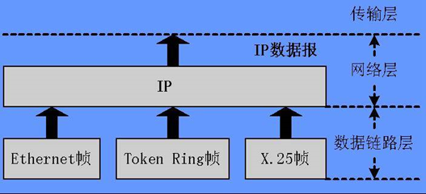
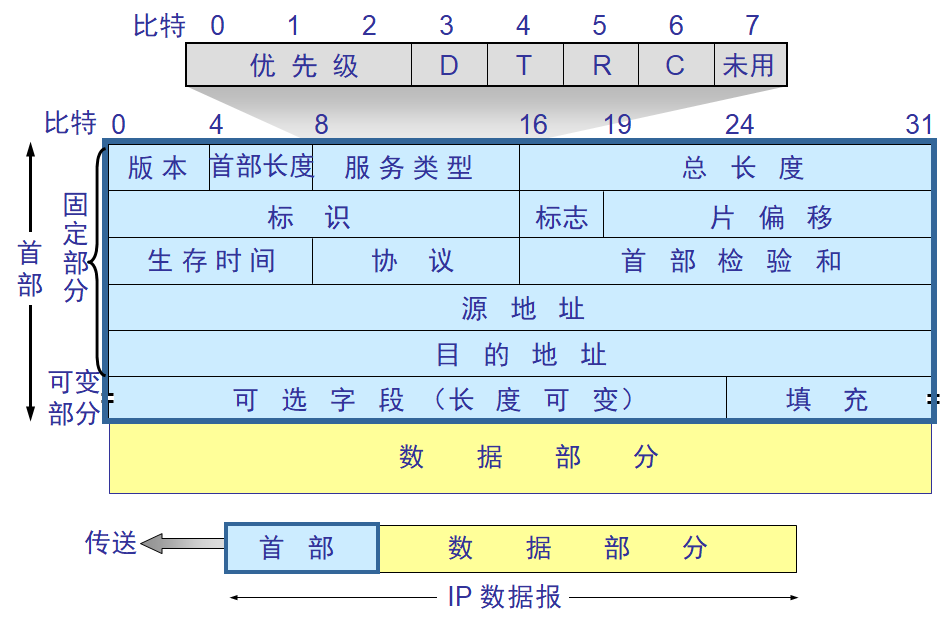
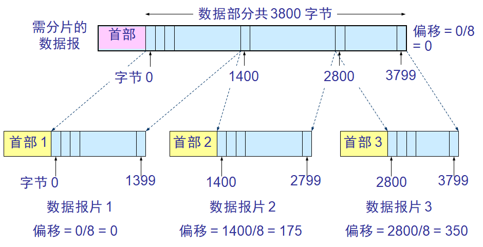
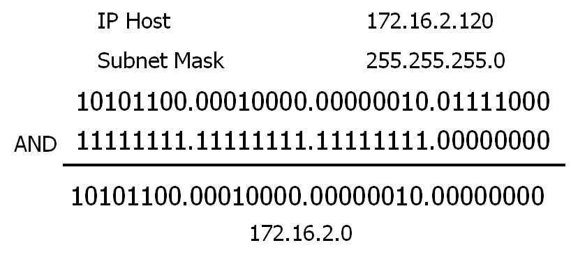
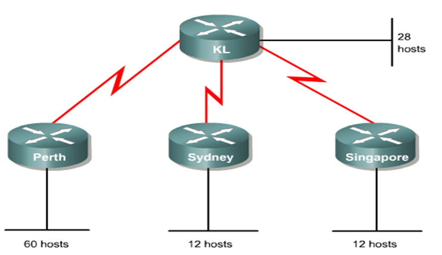
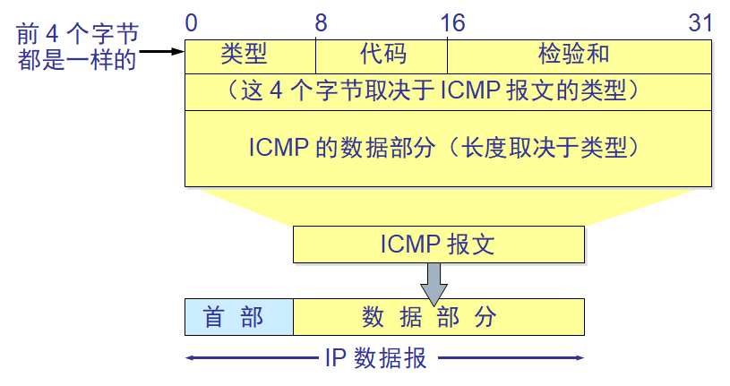

# Network Layer

## Overview of the Network Layer

### 网络层

#### 责任

+ 隔离广播域
+ 使用金字塔式地址体制
+ 屏蔽底层物理逻辑差异
+ 实现跨介质逻辑理解

#### Routers（路由器）

+ 不同网段分隔
+ 避免拥塞
+ 差异
  + 第二层：不同介质
  + 第三层：同介质，可以在中间
  + 第四层：只能终端

## IP Addresses and Subnets

### IPv4 Packet

#### 报文结构

#### 名词解释

+ ICMP - Internet Control Message Protocol：Internet控制报文协议
+ IGMP - Internet Group Management Protocol：Internet 组管理协议
+ UDP - User Datagram Protocol：用户数据报协议
+ OSPF - Open Shortest Path First：开放式最短路径优先，是一个内部网关协议
+ Datagram：数据报，网络层的PDU

#### 解析

+ 版本

  + 占 4 bit，指IP协议的版本
  + 目前的 IP 协议版本号为 4 (即 IPv4)

+ 首部长度

  + 占 4 bit，可表示的最大数值
  + 可变化（可变部分有40字节）
  + 是 15 个单位(一个单位为 4 字节)

  + 因此 IP 的首部长度的最大值是60字节。

+ 服务类型

  + 占 8 bit，用来获得更好的服务
  + 前6位是区分服务吗，后2位别的用途

  + 这个字段以前一直没有被人们使用

+ 总长度

  + 占 16 bit，指首部和数据之和的长度，

  + 单位为字节，因此数据报的最大长度为 65535 字节。

  + 总长度必须不超过最大传送单元 MTU。 

+ 标识

  + 占 16 bit，

  + 它是一个计数器，用来产生数据报的标识。
  + 做报文分片，确定是不是同一个原始报文

+ 标志

  + 占 3 bit，最高位为0

  + 最后位
    + MF（move fragment）
    + 为0表示最后一个分片
  + 中间位
    + DF（don't to fragment）
    + 为1则不允许分片

+ 片偏移

  + (13 bit)指出：较长的分组在分片后

  + 某片在原分组中的相对位置。

  + 片偏移以 8 个字节为偏移单位。
  + 偏移小的在前，大的在后，合成原始报文

  

+ 生存时间

  + (8 bit)记为 TTL (Time To Live)

  + 数据报在网络中可通过的路由器数的最大值。
  + 跳数限制，每次减1，减到0时丢弃报文

+ 协议

  + (8 bit)字段指出此数据报携带的数据使用何种协议

  + 以便目的主机的 IP 层将数据部分上交给哪个处理过程

+ 首部检验和

  + (16 bit)字段只检验数据报的首部

  + 不包括数据部分。

  + 这里不采用 CRC 检验码而采用简单的计算方法。

+ 源地址和目的地址

  + 各占 4 字节
  + 源地址在前，目的地址在后

### IP地址

#### 简介

+ 32Bits，Network ID（网络号） + host ID（主机号）

+ 不同类型的地址网络号和主机号的长度不同

#### 分类

| 字节开头 | 网络号    | 类型                                 |
| -------- | --------- | ------------------------------------ |
| 0        | 0 - 127   | Class A address                      |
| 10       | 128 - 191 | Class B address                      |
| 110      | 192 - 223 | Class C address                      |
| 1110     | 224 - 239 | Class D-Multicast（给特定应用程序）  |
| 11110    | 240 - 255 | Class E-Research（保留地址——测试用） |

#### 各类地址最多支持的主机数

+ Class A - 16,777,214 (2^24 - 2)
+ Class B - 65,534 (2^16 - 2)
+ Class C - 254 (2^8 - 2)

#### 保留地址

+ 网段地址：主机号全为 0

+ 广播地址：主机号全为 1

#### 私有地址空间

+ 10.0.0.0 - 10.255.255.255 （A 类）
+ 172.16.0.0 - 172.31.255.255 （B 类）
+ 192.168.0.0 - 192.168.255.255 （C 类）

#### 问题

+ IP地址消耗的解决办法：
  + NAT（即使用私有 IP 地址）
  + CIDR
  + IPv6（长期解决办法）
+ NAT - Network Address Translation：网络地址转换，将网络内部的私有IP地址转换为公有IP地址以节省IP地址的方法

### 子网

#### 介绍

+ 提供灵活的寻址，通常由网管分配，能够减少广播域 。
+ 从host位借若干位出来作为subnet
+ subnet和subnet之间属于不同网段
+ 最小可借位数 = 2（1位只能生产出一个子网地址，另一个是广播域）
+ 最大可借位数 = host ID 位数 - 2（host - 00：网络ID，11：广播地址）
+ 子网划分会造成地址的浪费。

| **Number of Bits Borrowed** | **Number of Subnets Created** | **Number of Hosts Per Subnet** | **Total**  **Number of Hosts** | **Percent Used** |
| --------------------------- | ----------------------------- | ------------------------------ | ------------------------------ | ---------------- |
| 2                           | 2  (2^2 - 2)                  | 62  (2^6 - 2)                  | 124  (原本2^8 - 2)             | 49%              |
| 3                           | 6                             | 30                             | 180                            | 71%              |
| 4                           | 14                            | 14                             | 196                            | 77%              |
| 5                           | 30                            | 6                              | 180                            | 71%              |
| 6                           | 62                            | 2                              | 124                            | 49%              |

+ 子网掩码
  + Class A 255.0.0.0
  + Class B 255.255.0.0
  + Class C 255.255.255.0

#### 划分步奏

+ 先确定是那类网

+ 再确定要多少子网以及每个子网可支持的主机数

+ 确定借位数（记得全0和全1的子网不能用）

+ 计算子网掩码（子网部分全取1）

+ 确定主机的可用地址范围 （全0和全1的不可用）

#### 计算子网地址

+ 将 IP 地址转化为二进制

+ 将子网掩码转化为二进制
+ 对两个数进行与操作
+ 将子网地址转化为带点的十进制（Network ID）

+ 每个路由接口都必须有一个单独的网段地址

#### 题目

+ We will subnet the IP address:223.14.17.0, Need:13 subnets, 10 hosts on each subnet
  + What class IP address is this?Class C, Class C default subnet mask:255.255.255.0
  + Borrow 4 bits from the host
  + The subnet mask is: 255.255.255.240
  + 16 *possible* subnets, 16 *possible* hosts on each subnet
  + 14 *available* subnets, 14 *available* hosts on each subnet

+ Given 195.137.92.0 and needing 8 usable subnets, find the subnetwork numbers, the ranges of host numbers, and subnetwork broadcast numbers.
  + IP Address is a class C. Default subnet mask is 255.255.255.0. We need to extend the network number by enough bits to give 8 usable subnets.
  + Stealing 2 bits yields 2 usable subnets, stealing 3 bits yields 6 usable subnets, so we must steal 4 bits to get 14 usable subnets, of which we needed 8. 
  + This makes the subnet mask 255.255.255.240. So the Network number is 195.137.92.NNNN HHHH where Ns stand for network extension bits (subnets) and Hs stand for host numbers.
  + Next we must number the subnets; there are 16 combinations of 4 bit binary numbers but they retain their place value within the last octet.

## Layer 3 Devices 

### Routers（路由器）

#### 功能

+ 路径决定（选择标准：带宽、延迟、hop）
+ 转发
+ 判断IP地址的网段，不是具体IP
+ 路由器每一个端口配一个MAC地址

#### 步奏

+ 收下帧并理解package里的MAC目的地址
+ 检查网络层的地址并且决定目的网段
+ 形成新的帧（源地址变为连接接收方网络那个端口的MAC地址）

#### 静态获取IP

+ 每个设备有专属于自己的IP地址
+ 如果使用重复的IP地址，可能会出现问题。

#### 动态获取IP

- RARP - Reverse Address Resolution Protocol：反向地址转换协议，ARP为IP到MAC的转换，而RARP为MAC到IP的转换，向RARP服务器请求分配IP

- BOOTP - Bootstrap Protocol：引导程序协议，向BOOTP服务器请求分配IP

- DHCP - Dynamic Host Configuration Protocol：动态主机配置协议，使网络环境中的主机动态的获得IP地址、Gateway地址、DNS服务器地址等信息

## ARP Protocol

### ARP

#### 介绍

+ ARP - Protocol Address Resolution Protocol：地址解析协议
+ 根据IP地址获得MAC地址
+ ARP Table：ARP缓存（有时效性）

#### 工作原理

+ 先查本地的ARP 表 （每个主机都维护一个 ARP 表） 
+ 如果不存在目的 IP 的 MAC地址，则广播（二层）
+ 目的主机收到广播报文之后，发现与自己的 IP 相匹配，就会发一个响应，其中包含自己的 MAC 地址
+ 源主机收到响应 报文之后，把目的主机 MAC 加入 ARP 表，然后再发送数据。

#### 目的地址不再本网段内

+ 默认网关：连接这个网段的路由器接口的 IP，之后发送数据就是转发给网关。（仍是 ARP 协议的一部分）

+ Proxy ARP （代理 ARP ）：中间设备（比如路由器）代表目的端发送一个 ARP，应答给发送请求的主机。

## Network Layer Services

### 服务

#### Connection oriented network services（面向连接的网络服务）

+ 传输数据前会在发送者和接受者之间建立连接。

#### Connectionless network services（无连接网络服务）

+ 分别对待每一个包。 每个包有不同的路径，可以不按次序到达 。
+ IP是无连接系统 。

#### Circuit switched（虚电路交换）

+ 所有报文走同一条虚电路
+ 好处：先发先到，坏处：占用问题

#### Packet switched（报文交换）

+ 原始数据分为多个子报文，子报文自行发送

## Routed and Routing Protocols

### 路由协议

#### routed protocol/routable protocol 

+ 被路由协议/可路由协议

+ 可以被路由器转发的协议，如 IP 。

#### Non routable protocol 

+ 不可路由协议
+ 不能被路由器转发的包的协议，如NetBEUI 。
+ 跨局域网就不行使用

#### routing protocol

+ 路由协议
+ 用于路由器之间的协议，以便它们可以动态地获知路由信息，并将它们添加到路由表中。

### 区分

#### Static Route

+ 静态路由
+ 配置默认路由

#### Dynamic Route

+ 动态路由
+ 自动维护路由表
+ 定时触发信息更新

#### IGP - Interior Gateway Protocols

+ 内部网关协议
+ 是一个在自治网络内网关间交换路由的协议

#### EGP - Exterior Gateway Protocols

+ 外部网关协议
+ 在自治网络间交换路由的协议

### IGP

#### DVP - Distance-Vector Protocols

+ 距离向量协议
+ 通过计算目标路由器与源路由器之间的距离矢量和来选择最佳路径，有频繁和周期性的更新，每次更新都将整张路由表发给周围的路由器，包括RIP, IGRP等。

 -  RIP

    + 路由信息协议，采用跳数作为距离计数的路由协议

-  IGRP - Interior Gateway Route Protocol：内部网关路由协议

#### LSP - Link State Protocols

+ 链路状态协议
+ 每个路由器都了解整个网络的拓扑结构，利用算法计算两个路由之间的最短路径，更新由事件触发，每次更新都只向周围的路由器传递路由表的更新信息，包括OSPF等。

- OSPF - Open Shortest Path First：开放最短路径优先，一般基于链路的带宽状态来评估

### DVP

#### RIP - Route Information Protocol

+ 跳数是唯一的度量标准
+ 最大跳数为15
+ 每30 秒更新一次；
+ 不总是选择最快路径；
+ 容易产生网络拥塞。

#### IGRP - Interior Gateway Route Protocol & EIGRP - Enhanced IGRP

+ 以延迟、带宽、链路负载、 可靠性 （链路错误率）为度量标准
+ 最大跳数为255
+ 每90秒更新一次 。

#### OSPF - Open Shortest Path First

+ 以代价、速度、通信量、 可靠性、 安全性为度 量；
+ 更新由事件触发 。

## VLSM

### 比较

#### Classful Routing 

+ 有类路由
+ 需要每个网段使用一个子网掩码

#### VLSM - Variable-Length Subnet Masks

+ 可变长子网掩码
+ 在借位的基础上，规定了一个网络在划分子网时的不同部分使用不同的子网掩码

### 内容

#### 名词解释

- CIDR - Classless Inter Domain Routing

  + 无类域间路由，是一个在Internet上创建附加地址的方法，这些地址提供给服务提供商（ISP），再由ISP分配给客户
  + (Tip: VLSM+CIDR就形成了划分子网时出现如  192.168.1.0/28  子网掩码255.255.255.240这样的形式)

- ICMP - Internet Control Message Protocol

  + 因特网控制报文协议，是为了提高IP数据报交付成功的机会，允许主机或路由器报告差错情况和提供有关异常情况报告的协议，运行在IP层

- PING - Packet Internet Groper

  + 因特网包探索器,用于测试网络连接量的程序。使用了ICMP回送请求和回送回答报文，是应用程序直接使用网络层ICMP的例子，没有通过TCP/UDP

#### 优点

+ 更有效的使用 IP 地址（提高地址利用率）

+ 使用路由汇总的能力更强

+ 支持无类路由的协议
  + OSPF、EIGRP、RIP v2、静态路由

#### 划分

+ 只有未使用的子网才能在被划分
+ 先划分需要主机数最多的，然后接着按次序划分。
+ 两个路由之间相连的端口各需要一个IP 地址。

#### 题目

+ A class C address of 192.168.10.0/24 has been allocated.
  + Perth, Sydney, and Singapore have a WAN connection to Kuala Lumpur (KL).
  + Perth requires 60 hosts.
  + KL requires 28 hosts.
  + Sydney and Singapore each require 12 hosts.

#### 路由聚合

+ 减少路由表条目的数量
+ 隔离拓扑的变化，减少工作量，避免路由表震荡

## ICMP

### 因特网控制报文协议

#### 介绍

+ 为了提高 IP 数据报交付成功的机会
+ ICMP 允许主机或路由器报告差错情况和提供有关异常情况的报告
+ ICMP 只是 IP 层的协议
+ ICMP 报文作为 IP 层数据报的数据，加上数据报的首部，组成 IP 数据报发送出去

#### 格式

#### 用法

+ 对 ICMP 差错报告报文不再发送 ICMP 差错报告报文

+ 对第一个分片的数据报片的所有后续数据报片都不发送 ICMP 差错报告报文

+ 对具有多播地址的数据报都不发送 ICMP 差错报告报文

+ 对具有特殊地址（如127.0.0.0或0.0.0.0）的数据报不发送 ICMP 差错报告报文

### PING

#### 介绍

+ PING 是用ICMP的"Echo request"和"Echo reply"消息来实现的

+ PING 用来测试两个主机之间的连通性

+ PING 使用了 ICMP 回送请求与回送回答报文

+ PING 是应用层直接使用网络层 ICMP 的例子，它没有通过运输层的 TCP 或UDP