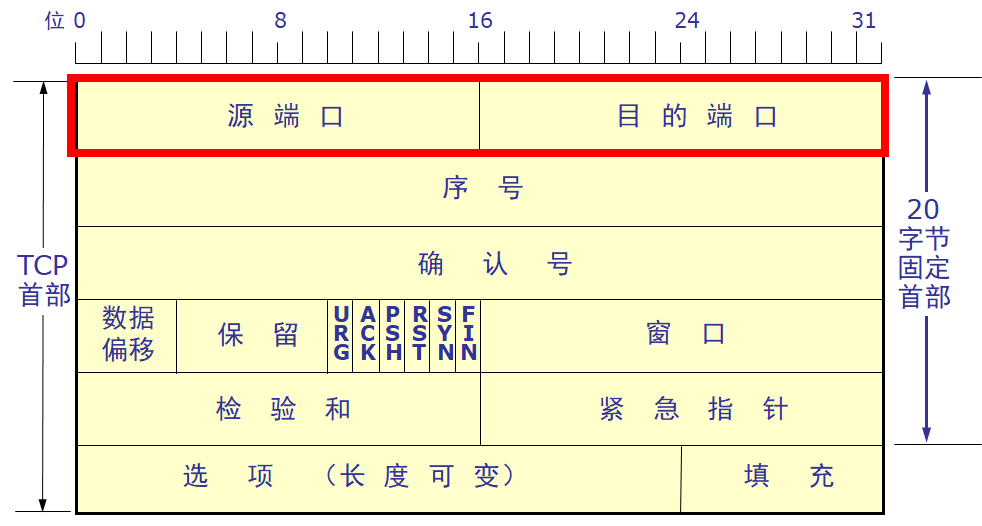
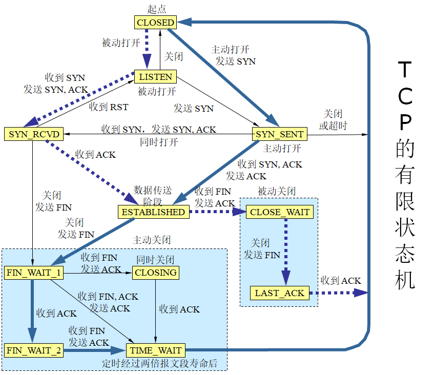
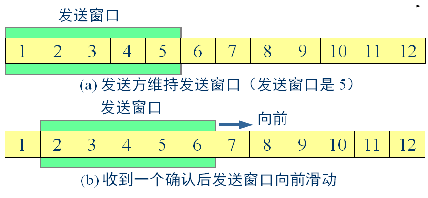
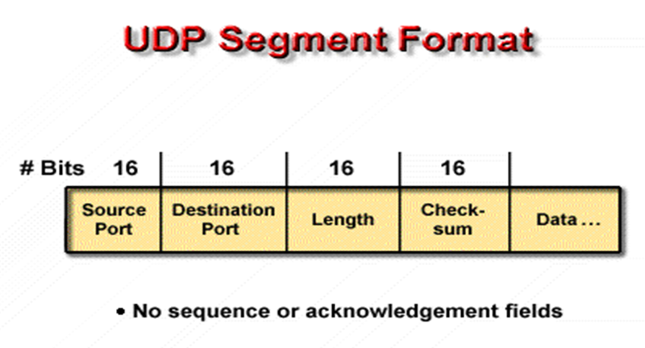

# Transport Layer

## An overview of layer 4

### 传输层

#### 协议

+ TCP - Transmission Control Protocol
  + 传输控制协议
  + 是一种面向连接的、可靠的、基于字节流的传输层通信协议。

+ UDP - User Datagram Protocol
  + 用户数据报协议
  + 是OSI参考模型中一种无连接的传输层协议，提供面向事务的简单不可靠信息传送服务。
  + 不做数据校验

#### 服务模块

+ 认操作系统识别不同上网进程

+ 应用可以使用端口
+ 1024 - 49151：登记使用端口

+ 0 - 255：public端口

## TCP (Transmission Control Protocol)

### 介绍

#### 服务模块

+ 可靠传输
+ 流控制
+ 连接安排
+ 不支持单播和组播

#### 报文格式

+ 源端口和目的端口字段

  + 各占 2 字节
  + 端口是运输层与应用层的服务接口
  + 运输层的复用和分用功能都要通过端口才能实现 
  + 源端口在前，目的端口在后。

+ 序号字段

  + 占 4 字节

  + 可靠传输主要逻辑
  + TCP 传送的数据流中的每一个字节都编上一个序号（序号不够就从零重新计数）

  + 序号字段的值指本报文段所发送的数据的第一个字节的序号

+ 确认号字段

  + 占 4 字节
  + 是期望收到对方的下一个报文段的数据的第一个字节的序号
  + Ex. 上次到700，确认号701

+ 数据偏移（即首部长度）

  + 占 4 位

  + 指出 TCP 报文段的数据起始处距TCP 报文段的起始处的长度

  + 单位是 32 位字（以 4 字节为计算单位）

+ 保留字段

  + 占 6 位，保留为今后使用，目前置 0

+ 紧急 URG = 1 时，表明紧急指针字段有效
  + 告诉系统此报文段中有紧急数据，应尽快传送(相当于高优先级的数据)

+ ACK

  + ACK = 1 时确认号字段有效

  + ACK = 0 时确认号字段无效

+ 推送 PSH (PuSH)

  + 接收 TCP 收到 PSH = 1 的报文段，就尽快地交付接收应用进程，而不再等到整个缓存都填满了后再向上交付 

+ 复位 RST 
  + ReSeT= 1 时，表明 TCP 连接中出现严重差错（如由于主机崩溃或其他原因），必须释放连接，然后再重新建立运输连接
+ 同步 SYN
  + SYN = 1 表示这是一个连接请求或连接接受报文
+ 终止 FIN (FINish) 
  + 用来释放一个连接。
  + FIN = 1 表明此报文段的发送端的数据已发送完毕，并要求释放运输连接。
+ 窗口字段 
  + 占 2 字节，用来让对方设置发送窗口的依据，单位为字节。
+ 检验和
  + 占 2 字节。检验和字段检验的范围包括首部和数据这两部分
+ 紧急指针字段
  + 占 16 位，指出在本报文段中紧急数据共有多少个字节（紧急数据放在本报文段数据的最前面）  

+ TCP 最初只有一种选项，即最大报文段长度 MSS(Maximum Segment Size)
  + MSS 告诉对方缓存所能接收的报文段的数据字段的最大长度是 MSS 个字节
  + 数据字段加上 TCP 首部才等于整个的 TCP 报文段
+ 填充字段
  + 这是为了使整个首部长度是 4 字节的整数倍。

#### 有限状态机

### 建立连接

#### 三次握手

#### 例子

​        TCP A                                                                                   TCP B

1. CLOSED                                                                              LISTEN

2. SYN-SENT  --> <SEQ=100><CTL=SYN>    -->            SYN-RECEIVED

3. ESTABLISHED <-- <SEQ=300><ACK=101><CTL=SYN,ACK> <-- SYN-RECEIVED
4. ESTABLISHED --> <SEQ=101><ACK=301><CTL=ACK>    --> ESTABLISHED

5. ESTABLISHED --> <SEQ=101><ACK=301><CTL=ACK>\<DATA\> --> ESTABLISHED

### ARQ

#### 名词解释

+ ARQ - Automatic Repeat reQuest：自动重传请求；是OSI模型中数据链路层的错误纠正协议之一。

#### 过程

+ 发送端要发送 900 字节长的数据，划分为 9 个 100 字节长的报文段，而发送窗口确定为 500 字节。

+ 发送端只要收到了对方的确认，发送窗口就可前移。

+ 发送 TCP 要维护一个指针。每发送一个报文段，指针就向前移动一个报文段的距离。

+ 发送端收到了对方对前 400 字节数据的确认，但对方通知发送端必须把窗口减小到 400 字节。

+ 现在发送端最多还可发送 400 字节的数据。

### 拆除连接

#### 四次握手

+ 第一次：客户端 → 服务器， FIN = 1

+ 第二次：服务器 → 客户端， ACK = 1

+ 第三次：服务器 → 客户端， FIN = 1， ACK = 1

+ 第四次：客户端 → 服务器， ACK = 1

#### 2MSL

+ 确定最后的ACK有送达
+ 预防未经许可的连接

## UDP

### 介绍

#### 特色

+ UDP - User Datagram Protocol：用户数据报协议，是OSI参考模型中一种无连接的传输层协议，提供面向事务的简单不可靠信息传送服务。

+ 无连接、不可靠传输
+ 适用场合
  + 对丢包可以忍受
  + 对速率敏感
+ 用UDP传输的协议
  + RIP，DNS，SNMP，TFTP，DHCP

#### 报文格式

## An application: NAT and PAT

### NAT

#### 介绍

+ Network Address Translation：网络地址转换
+ 是一种把内部私有网络地址（IP地址）翻译成合法网络IP地址的技术。

#### 种类

#### Static NAT

+ 静态转换是指将内部网络的私有IP地址转换为公有IP地址，
+ IP地址对是一对一的，是一成不变的，某个私有IP地址只转换为某个公有IP地址。
+ 借助于静态转换，可以实现外部网络对内部网络中某些特定设备(如服务器)的访问。

#### Dynamic NAT

+ 动态转换是指将内部网络的私有IP地址转换为公用IP地址时，IP地址是不确定的，是随机的，所有被授权访问上Internet的私有IP地址可随机转换为任何指定的合法IP地址。
+ 也就是说，只要指定哪些内部地址可以进行转换，以及用哪些合法地址作为外部地址时，就可以进行动态转换。
+ 动态转换根据先来先服务原则，可以使用多个合法外部地址集。当ISP提供的合法IP地址略少于网络内部的计算机数量时，可以采用动态转换的方式。

#### PAT

+ PAT是指改变外出数据包的源端口并进行端口转换，即端口地址转换(PAT，Port Address Translation)。采用端口多路复用方式。
+ 内部网络的所有主机均可共享一个合法外部IP地址实现对Internet的访问，从而可以最大限度地节约IP地址资源。
+ 同时，又可隐藏网络内部的所有主机，有效避免来自internet的攻击。因此，目前网络中应用最多的就是端口多路复用方式。

#### 优点

+ 可以多台机器使用少量地址。

#### 缺点

+ 只能一对一映射，同时可以接入网络的主机少。