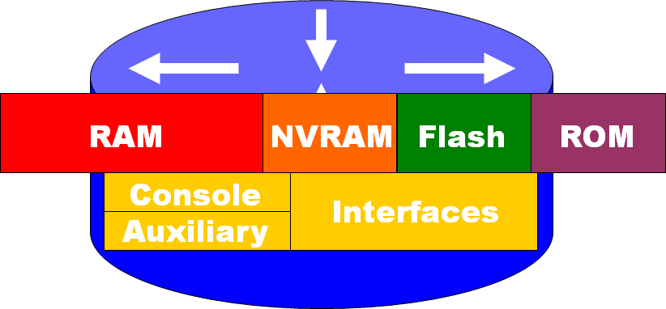
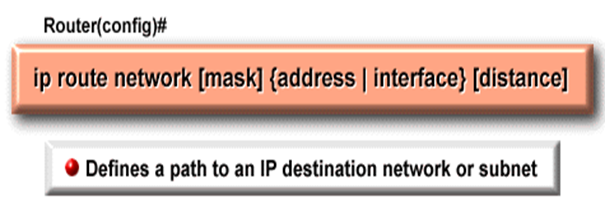

# Routing and Routers

## Router Basics

### 内部组成

#### 总体

#### RAM

+ 访问快
+ 临时存储路由表、ARP缓存、快速交换缓存、包缓冲、包等待队列，关机或重启后信息会丢失。

#### NVRAM

+ 非易失RAM，存储备份或启动配置文件，关机或重启后信息不会丢失。
+ 在RAM上放特定电池来供电
+ 访问快
+ 存储启动配置. 这包括IP地址，路由协议，主机名
+ Startup-config

#### FLASH

+ 存储Cisco IOS，允许不更换芯片升级软件，可以存储多个版本的IOS，断点后保留信息。
+ 非易失

#### ROM

+ 带有加电自检，用于加载ISO的引导程序和操作系统的备份。
+ 放操作系统

#### Interface

+ 包出入的接口。

+ 拥有多种物理接口用于连接网络.
  + Console 口、Auxiliary 口、以太网、快速以太网、串口、DSL、ISDN、Cable

### 路由器系统

#### IOS启动

+ POST - Power On Self Test（加电自检），对所有硬件模块执行ROM中的诊断程序；

+ 检验CPU、内存和网卡端口的所有基本操作；

+ 初始化软件：在CPU上执行ROM中的引导程序；

+ 初始化软件：查找操作系统；
+ 初始化软件：加载操作系统镜像；
+ 初始化软件：加载NVRAM中的配置文件并执行；
+ 初始化软件：如果没有找到配置文件，操作系统进入setup mode。

+ 总体来说，就是先定位IOS再载入

#### 检验配置

+ 使用 *show running-config* 命令
+ 存储路由器基本配置 *copy running-config* *startup-config*
+ 其他检验路由器的命令:
  + *Show running-config* – 显示当前随机访问存储器中的配置
  + *Show startup-config* – 显示NVRAM中的配置文件
  + *Show IP route* – 现实路由表
  + *Show interfaces* – 显示所有接口的配置信息
  + *Show IP* *int* *brief* -显示接口的简要信息

### Route

#### 静态路由

+ 出于安全原因希望隐藏一部分网络；

+ 当一个网段只能通过一条路径被访问到，静态路由就足够了，这样的分割叫做终端网络。

#### administrative distance

+ 管理距离（类似可信度）
+ 区分路由表学习来源
+ 提供路由可靠性的一个可选参数，0-255；
+ 管理值越小越可靠；
+ 静态路由的管理距离通常为1。

#### 动态路由

+ 路由器能够自动地建立自己的路由表，并且能够根据实际情况的变化适时地进行调整。
+ 功能
  + 路由表维护
  + 与其他路由器的信息区分

### 路由环路

#### 问题

+ 动态路由问题
+ 路由环路 → 计数到无穷大

#### 解决

+ 定义最大跳数
  + 当计数大于最大跳数时丢弃报文。

+ 水平分割
  + 由一个接口发送出去的路由信息不能再朝这个接口往回发送。

+ 路由毒化
  + 路由信息在路由表中失效的时候，把该表项的的度量值（metric）设为无穷大16，而不是马上从路由表中删掉这条路由信息，再将其信息发布出去，这样相邻的路由器就得知这条路由已无效了。

+ 毒性反转
  + 它是指收到路由中毒消息的路由器，不遵守水平分割原则将中毒消息转发给所有的相邻路由器，也包括发送中毒信息的源路由器，也就是通告相邻路由器这条路由信息己失效了。主要是为了达到快速收敛的目的。

+ 抑制定时器
  + 一条路由信息无效之后，一段时间内这条路由都处于抑制状态，即在一定时间内不再接收关于同一目的地址的路由更新。如果，路由器从一个网段上得知一条路径失效，然后，立即在另一个网段上得知这个路由有效。这个有效的信息往往是不正确的，抑制计时避免了这个问题，而且，当一条链路频繁起停时，抑制计时减少了路由的浮动，增加了网络的稳定性。

+ 触发更新
  + 当路由失效时，不再等待下一个更新周期，而是立即出发，发布毒化路由更新。

### link-state

#### LSA

+ link-state advertisement，链路状态通告
+ 使用SPF(Shortest Path First)最短路径算法，这个算法其实就是Dijkstra算法，是LSP中计算路径的一种方式

#### OSPF

- DR(Designated Router)

  + 指定路由器，在OSPF多路访问网络中，在同一个区域内被选举出来代表所有路由的路由。为了减少在同一个网段中几个邻居互相交换信息的数量

- BDR(Backup Designated Router)

  + 备份指定路由器，对DR的备份

#### 问题

+ 处理器和内存的需求：链路状态协议比距离矢量协议对处理器和内存的要求都更高；

+ 带宽的需求：初始化链路状态包洪泛的时候会临时使可用带宽减小。

距离矢量协议（Distance-Vector）与链路状态协议（Link-state）的比较：

| **距离矢量协议**             | **链路状态协议**         |
| ---------------------------- | ------------------------ |
| 从邻居处获得对网络拓扑的认识 | 获取对整个网络拓扑的认识 |
| 路由与路由间计算距离矢量     | 路由与路由间计算最短路径 |
| 频繁的路由更新，低收敛速度   | 事件驱动更新，快收敛速度 |
| 向邻居路由传递路由表的备份   | 传递的是链路状态更新     |

### Hybrid Protocols

### 混合协议

+ IS-IS - Intermediate System-to-Intermediate System：中间系统到中间系统，是一种LSP和DVP混合的协议
+ EIGRP - Enhanced Interior Gateway Routing Protocol：增强内部网关协议，也是一种LSP和DVP混合的协议

## 路由协议

### IP路由协议

+ RIP - 距离矢量协议

+ IGRP - 思科的距离矢量协议

+ OSPF - 链路状态协议

+ EIGRP - 混合协议

#### 目标

+ 优化路由
+ 效率
+ 快速覆盖
+ 弹性

#### 默认路由

+ 当目的地址不在路由表中时，将报文发给默认路由。使路由表更短。

