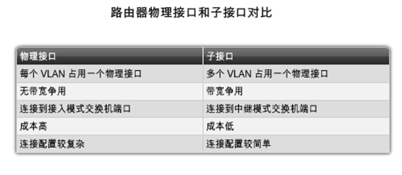

# LAN Switching and VLAN

## Switching

### 操作

#### 功能

+ 基于MAC地址的交换表的建造与维持
+ 将接口帧交换到目的地

### 种类

#### Symmetric Switching

+ 对称交换。交换机上所有端口带宽一样

#### Asymmetric Switching

+ 非对称交换。不同端口带宽不同
+ Cisco catalyst 都是非对称的

### 内存缓冲区

#### 类型

+ 基于端口的内存缓冲区
  + 可能会由于目的端口堵塞而导致源端口的帧不得转发而耽误源端口后面的帧不得正常发送。

+ 共享的内存缓冲区
  + 动态分配各个端口所需要的缓存内存量·

### 交换方法

#### 类型

+ store-and-forward（存储转发）：通过对网络帧的读取进行验错和控制；

+ cut-through转发
  + Fast forward switching：快速交换前只检查目的MAC地址；
  + Fragment Free：读取前64字节以减少错误。

## The Spanning-Tree Protocol

### 交换机回路

#### 问题

+ 冗余的结果
+ 广播回路
+ 桥的表出现问题

#### 结果

+ 以太网帧没有TTL字段
+ 消耗资源

### STP

#### 介绍

+ 解决第二层回路问题
+ 减少冗余路径而不导致网络延时

+ 通过计算稳定的生成树网络拓扑来防止网络环路

+ 发送BPDU来决定生成树拓扑

#### 决定顺序

+ 最低的根网桥（BID）；

+ 到跟网桥最低的路径成本

+ 最低的发送网桥ID（每个链路有没有两个以上的交换机在连）

+ 最低的端口ID

#### BPDU

+ Bridge Protocol Data Unit，桥接数据单元。
+ STP建立一个叫做根桥的根节点，生成树从根桥开始。
+ 非最短路径的冗余链路将被阻塞，从阻塞链路发来的数据帧将被丢弃。
+ STP需要网络设备互相交换消息来检测桥接环境，BPDU是交换机发送的用于构建无环路拓扑的消息。
+ 一段时间后得到全局稳定的内容

#### BID

+ Bridge ID，桥接器ID。
+ 8字节，由优先级和交换机的MAC地址组成，用于选举根桥接器、根端口等

#### 五个状态

+ 阻塞（Blocking）：不转发帧，监听BPDU

+ 监听（Listening）：不转发帧，监听数据帧

+ 学习（Learning）：不转发帧，学习地址

+ 转发（Forwarding）：转发帧，学习地址

+ 禁止（Disable）：不转发帧，不监听BPDU

### STP收敛步骤

#### STEP1

+ 选举根桥
+ 根桥的所有端口都是指定端口，指定端口都处于转发状态，BID最小的交换机被选为根；

#### STEP2

+ 在非根桥上选举根端口
+ 选择从非根桥到根桥的最低花费的那条路径；

+ ROOT port选择时可能要比较端口号，可以配置交换机各个端口的优先级。默认是128

#### STEP3

+ 在每个网段中选择指定端口
+ 比较BID
+ 指定端口是在拥有到根桥最低花费路径的网桥上选举的，所有非指定端口将被阻塞。

#### 例子

## VLAN

### Introduction of VLAN

#### LANs & VLANs

+ VLAN
  + 第二层与第三层
  + 控制广播
  + 提供更好的安全性

#### 介绍

+ 逻辑的网络设备或用户分组

+ 产生单一的广播域

+ 通过交换机实现
+ 两个VLAN中的机器通过路由器通信。

#### Group User

+ 逻辑区分用户到不同子网
+ 相同VLAN ID的能直接广播
+ 区分
  + port
  + MAC地址
  + 协议使用
  + 应用使用

### VLAN Architecture

#### Backbone

+ 主干。用于VLAN间的通信。
+ 连接两个交换机与路由器

#### 实现方法

+ 帧过滤
+ 帧标记

#### 帧过滤

+ 阻止不符合条件的帧
+ 使用交换表

#### 帧标记

+ 在每个要被在主干线路上转发的帧的头部加上一个独特的标签，用来标识它来自哪一个VLAN。
+ 离开主干线路时被去除。

### VLAN Implementation

#### 实现方法

+ 静态VLAN
+ 动态VLAN

#### 静态VLAN

+ 直接指派端口所属的VLAN。
+ 好处
  + 安全、容易认证和监控

#### 动态VLAN

+ 当有新的节点插入端口时，交换机查表来动态配置这个端口所属的VLAN
+ 好处
  + 当用户增加或移动时，减少行政开销

#### Port-Centric VLAN

+ 以端口为中心的VLAN。
+ 同一VLAN下的所有节点接入到同一个路由器接口上，或者反过来说，接入同一个路由器端口的节点被划分到同一个VLAN下。

#### Access Links

+ 接入链路

+ 只在一个VLAN中的链路，任何接入的设备并不知情有VLAN的存在。

####  Trunk Links

+ 中继链路
+ 点对点，支持多个VLAN，支持在快速以太网和G比特以太网，节省端口，可能有一个本地VLAN。
+ 用于连接交换机与交换机或路由器。(总之其实就是一根线上多个VLAN的帧在跑，所以这些帧得打上标签标识它来自于哪一个VLAN，不然就搞混了。到达对面的交换机之后再根据标签把这些帧转发到对应的VLAN里面去。Trunk链路最大的好处只是省端口和方便配置，以牺牲一点性能为代价。)
+ Trunk链路也可以有本地VLAN，即在trunk链路因为一些原因失败的时候使用的VLAN。

### Routing Between VLANs

#### 名词解释

+ CDP - Cisco Discovery Protocol：思科设备发现协议

+ VTP - VLAN Trunking Protocol：VLAN中继协议

+ Routing Between VLANs：VLAN间路由

#### 比较

