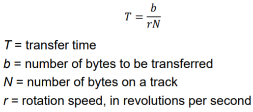

### 外存的需求

1. **特性：**
   + 大容量.（不会一直被使用）
   + 不易失

### 磁盘

1. **物理特性：**

   + 衬底：铝、铝合金、**玻璃**

   + 使用玻璃的好处：稳定性高，减少读写错误、支持更低的飞行高度，不容易损坏

   + 磁头 ——读写磁盘数据

     + 可运动（一个读写头）
     + 不可运动（需要多个磁头）

   + 磁盘

     + 可移动

     + 不可移动（读写过程中，磁头做径向运动，磁盘旋转）

   + 面

     + 双面

     + 单面

   + 盘片： 单盘、 **多盘**

   + 柱面：

        + 位于同一圆柱表面上的圈

        + 影响多盘效率的因素： 多盘的情况下，每个盘的磁头只能位于盘面的同一个柱面。

   + 磁头机制： 

      + 接触式（软盘） 固定悬空高度、 可变悬空高度
      + 磁头通过电磁感应进行读写，为增加数据量，可将圈变窄，相应磁头就得变小，此时电磁感应变弱，必须降低磁盘高度，即飞行高度）
      + 关于Winchester head 温氏磁盘、磁头封装在一个无污染的密封装置中。和常规磁头相比，可以更加贴近磁表面，数据密度更大。磁盘不动时，以气垫的形式使磁头轻停在磁盘表面。磁盘旋转时，产生的气压使气垫升高而将磁头与盘面分离。

2. **磁盘的工作机制：**

   + 根据极性记录数据
   + 读写时，磁头固定，磁盘旋转
   
   + 写：正负电流产生不同的脉冲信号传至磁头，表面上产生不同磁性的磁化域，分别代表0、1
   + 读：磁场相对磁头运动，在磁头中产生电流，不同的极性产生不同方向的电流
   
   + 磁盘的数据组织
   
     + 磁道：数据由同心圆组成，每个同心圆即磁道
   + 扇区：每个磁道被分隔为多个区域，存储大小一定，一般为512B
      + 匀角速度：增加外圈数据间的空间，使得相同角度经过的扇区数目相同（浪费空间）
   + 多带记录数据：把磁盘分为多个带，同一个带中采取相同的划分方式，不同带之间的划分方式不同   
      + 优点：增加存储量 缺点：需要更加复杂的电路。
    + 扇区内的数据组织：GAP间隙：为磁头提供反应时间
      + ID FILED： 同步信息，判断是否到达新的扇区（格式化就是划分扇区，给ID Field写入信息）
      + 数据区域（515B）其中1B为同步信息，512存储数据，2B为CPR产生校验码

3. **数据时间的计算：**

   + 寻道时间/旋转等待时间：移动磁头定位到要访问的磁道所花费的时间
   + 传输时间：T=b/(rN) b为需要存储的数据量，r为转速，N为每个磁道上的数据

   

   + 存取时间 =寻道时间 + 旋转等待时间 + 传送时间 Ta = Ts + 1/2r + b/rN

   

### 光盘

1. **CD 与 CD-ROM：**

   + 母盘，用高强度激光烧盘
   + 压盘，台、凹坑
   + 激光打向背面，根据反射强弱读取信息
   + 不同点：CD-ROM有检验码 而CD没有
   + 优点：方便，成本低，便于携带
   + 缺点：无法更新数据，读取较慢
2. **CD-R：**

   + 感光元器件，可写一次
   + CD-RW 可擦写
3. **CD-RW：**
   + 使用在两种状态下有不同反射率的物质，可以被雷射光改变。
   + 在用 500,000 到 1,000,000 使用后会失去这个特性。
4. **DVD：**
   + 数字通用盘 相比较CD 

     + 双面读，反射层在中间

     + 半反射，同样写记录数据
     + 对波长要求更短，信号更密集
     + 蓝光 运用更短的波长，使得刻录更加密集
   + 强调：光盘为螺旋线（光驱旋转，线速度相同）（与磁盘不同）
5. **磁带 Magnetic Tape：**
   + 使用与磁盘相同的存储机制
   + 离线备份，容量大，存取快
   + 使用磁性材料
   + 并行&串行（蛇形排列）