# 体系结构

## 09 - 基础

### 概念和定义

+ 软件体系结构={部件(Component),连接件(Connector),配置(Configuration)}
  + “部件”是软件体系结构的基本组成单位之⼀,承载系统的主要功能,包括处理与数据;
  + “连接件”是软件体系结构的另⼀个基本组成单位,定义了部件间的交互,是连接的抽象表示;
  + “配置”是对“形式”的发展,定义了“部件”以及“连接件”之间的关联⽅式,将它们组织成系统的总体结构。
+ ⼀个软件系统的体系结构规定了系统的计算部件和部件之间的交互

+ 高层抽象
+ 多重视角
+ 设计决定

### 高层抽象

#### 部件&连接件

+ 连接件是⼀个与部件平等的单位。
+ 部件与连接件是⽐类、模块等软件单位更⾼层次的抽象。

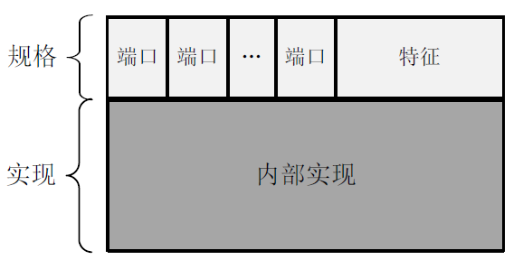

#### 好处

+ 直观，便于理解
+ 验证正确性
+ 关注度分离，降低复杂度

### 主程序子程序风格

#### 设计决策与约束

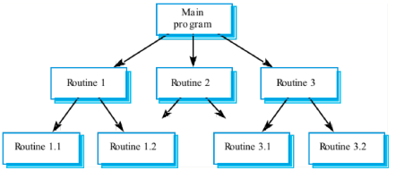

+ 基于声明-使⽤(程序调⽤)关系建⽴连接件,以层次分解的⽅式建⽴系统部件,共同组成层次结构。
+ 每⼀个上层部件可以“使⽤”下层部件,但下层部件不能“使⽤”上层部件,即不允许逆⽅向调⽤。
+ 系统应该是单线程执⾏。主程序部件拥有最初的执⾏控制权,并在“使⽤”中将控制权转移给下层⼦程序。
+ ⼦程序只能够通过上层转移来获得控制权,可以在执⾏中将控制权转交给下层的⼦程序,并在⾃身执⾏完成之后必须将控制权还交给上层部件。

#### 实现

+ 功能分解
+ 集中控制
+ 每个构件⼀个模块实现
  + 主要是单向依赖
+ 使⽤utility或tools等基础模块

### 面向对象式风格

#### 设计决策与约束

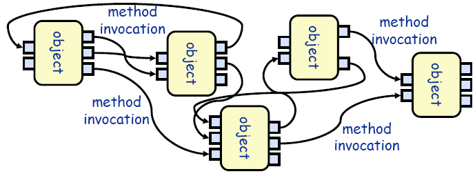

+ 依照对数据的使⽤情况,⽤信息内聚的标准,为系统建⽴对象部件。每个对象部件基于内部数据提供对外服务接⼝,并隐藏内部数据的表示。
+ 基于⽅法调⽤(Method Invocation)机制建⽴连接件,将对象部件连接起来。
+ 每个对象负责维护其⾃身数据的⼀致性与完整性,并以此为基础对外提供“正确”的服务。
+ 每个对象都是⼀个⾃治单位,不同对象之间是平级的,没有主次、从属、层次、分解等关系。

#### 实现

+ 任务分解
+ （委托式）分散式控制
+ 每个构件⼀个模块实现
  + 使⽤接⼝将双向依赖转换为单向依赖
  + 将每个构件分割为多个模块，以保证单向依赖
  + 每个模块内部可以是基于⾯向对象⽅法，也可以基于结构化
+ 使⽤utility或tools等基础模块

### 分层风格

#### 设计决策与约束

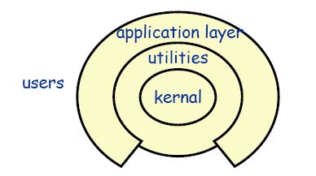

+ 从最底层到最⾼层,部件的抽象层次逐渐提升。每个下层为邻接上层提供服务, 每个上层将邻接下层作为基础设施使⽤。也就是说,在程序调⽤机制中上层调⽤下层。
+ 两个层次之间的连接要遵守特定的交互协议,该交互协议应该是成熟、稳定和 标准化的。也就是说,只要遵守交互协议,不同部件实例之间是可以互相替换的。
+ 跨层次的连接是禁⽌的,不允许第 I 层直接调⽤ I+N(N>1)层的服务。
+ 逆向的连接是禁⽌的,不允许第 I 层调⽤第 J(J<I)层的服务。

#### 实现

+ 关注点分离（每层逐次抽象）
+ 层间接⼝使⽤固定协议（固定控制）
+ 每层⼀或多个模块实现
  + 单向依赖
  + 层间数据传递建⽴专⻔模块
+ 使⽤utility或tools等基础模块

#### 示例

+ 连锁超市系统

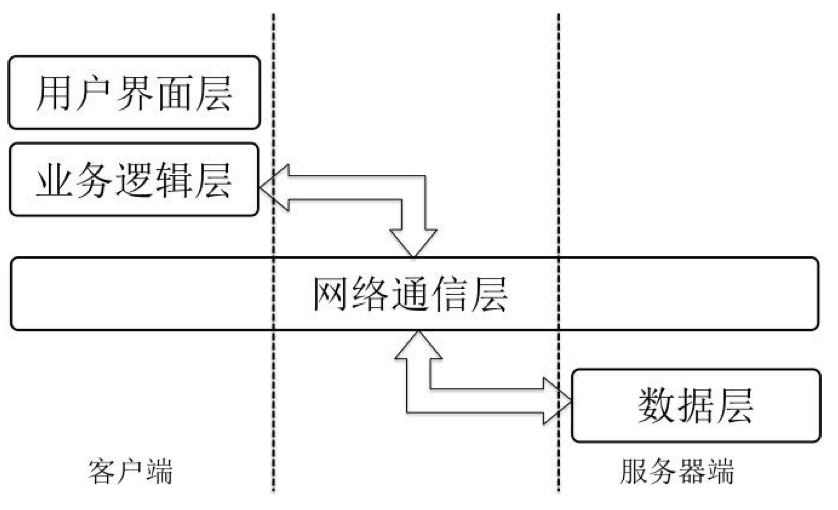

### MVC风格

#### 设计决策与实现

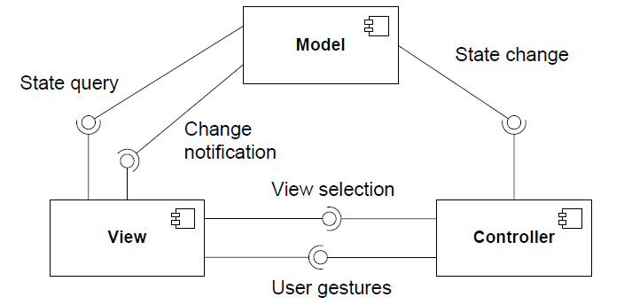

+ Model负责维护数据与通知View信息的变更
+ View负责显示信息给用户与传送用户操作给Controller
+ Controller负责改变Model的状态与View的选择
+ 模型、视图、控制是分别是关于业务逻辑、表现和控制的三种不同内容抽象。
+ 如果视图需要持续地显示某个数据的状态,那么它⾸先需要在模型中注册对该数据的兴趣。
  如果该数据状态发⽣了变更,模型会主动通知视图,然后再由视图查询数据的更新 情况。
+ 视图只能使⽤模型的数据查询服务,只有控制部件可以调⽤可能修改模型状态的程 序。
+ ⽤户⾏为虽然由视图发起,但是必须转交给控制部件处理。对接收到的⽤户⾏为, 控制部件可能会执⾏两种处理中的⼀种或两种:调⽤模型的服务,执⾏业务逻辑;提供下⼀ 个业务展现。
+ 模型部件相对独⽴,既不依赖于视图,也不依赖于控制。虽然模型与视图之间存在 ⼀个“通知变更”的连接,但该连接的交互协议是⾮常稳定的,可以认为是⾮常弱的依赖。

#### 实现

+ 模型-视图-控制⻛格需要为模型、视图和控制的每个部件实例建⽴模块实现,各模块间 存在导⼊/导出关系,程序调⽤连接件不需要显式的实现。
+ 特定技术实现，通常专⽤于WEB
  + Model与Controller单向
  + Controller与View双向
  + Model与View双向
+ 典型实现
  + View：JSP，HTML
  + Controller：Servlet
  + Model：JavaBean

#### 示例

+ 连锁超市系统

## 10 - 设计与构建

### 设计过程

1. 分析关键需求和项⽬约束；
2. 通过选择体系结构⻛格；
3. 进⾏软件体系结构逻辑（抽象）设计；
4. 依赖逻辑设计进⾏软件体系结构（实现）设计；
5. 完善体系结构设计；
6. 添加构件接⼝；
7. 迭代过程3-7

#### 关键需求和项目约束

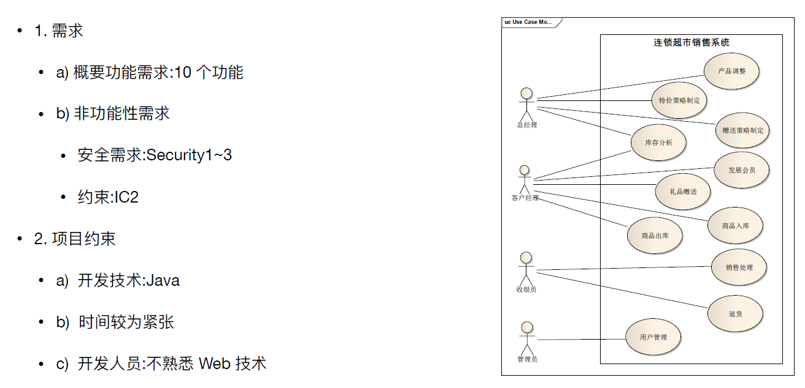

#### 选择风格

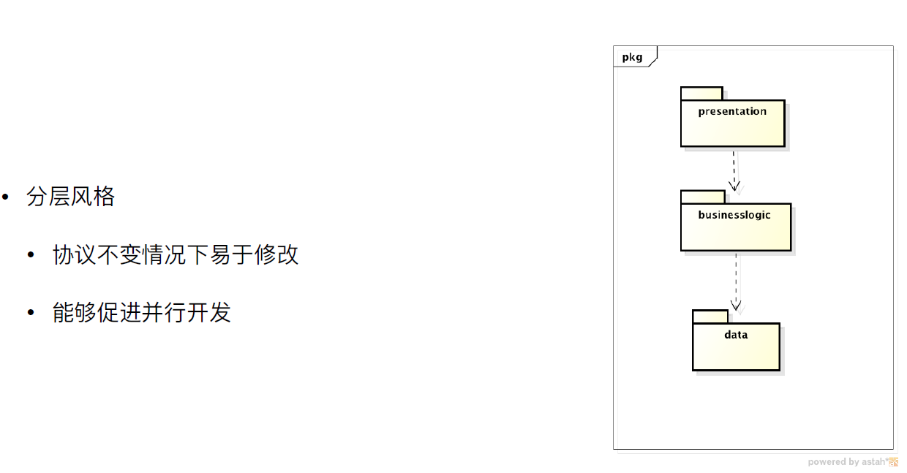

#### 抽象设计

+ RMI：远程方法调用

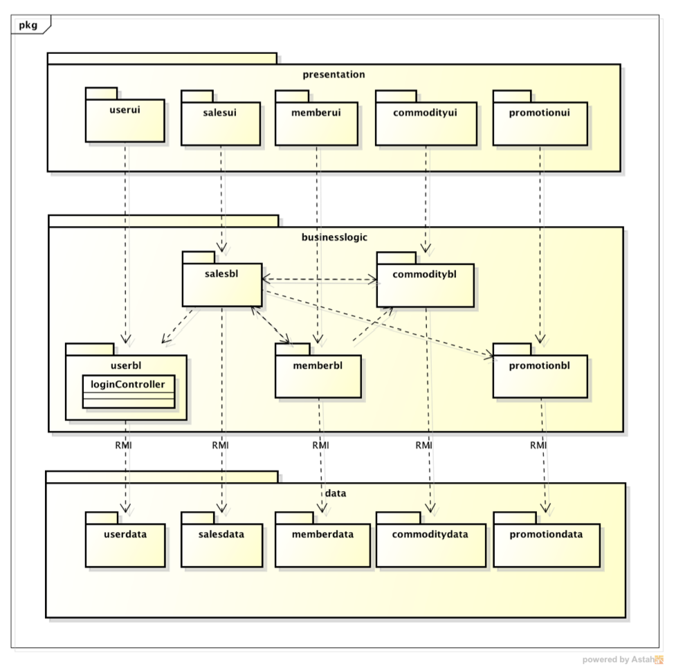

#### 实现设计

+ 开发包设计过程
  + 先CCP 原则对把可能⼀同变化的类组织成包进⾏发布,
  + 随着系统的不断增⻓,我们开始关注创建可重⽤的元素,于是开始使⽤ CRP 和 REP 来指导包的组合。
  + 最后使⽤ ADP、SDP、SAP 对包图进⾏度量，去掉不好的依赖。
+ 名词解释
  + CCP：共同封闭原则；需要一起改的类放一起
  + CRP：共同重用原则；类应该可以被重用
  + REP：共同发布原则；单元的重用与单元的释放
  + ADP：无环依赖原则；包之间不要有循环依赖
  + SDP：稳定依赖原则；不稳定性 = 输出耦合度 / (输入耦合度 + 输出耦合度)
  + SAP：稳定抽象原则；稳定的包尽量是抽象包

##### 客户端

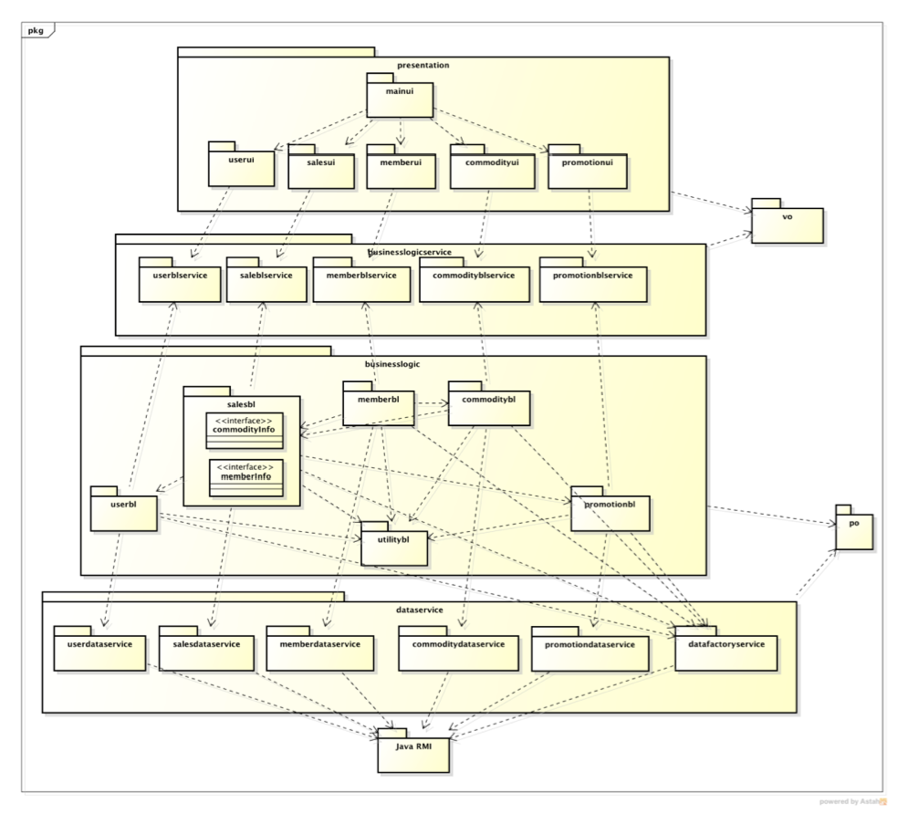

##### 服务器端

##### 进程图

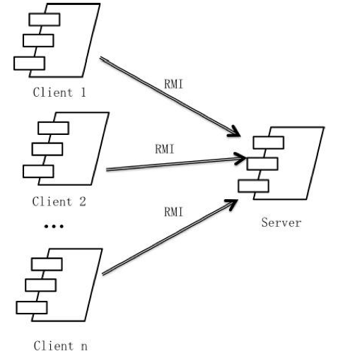

##### 部署图

#### 完善设计

+ VO(Value Objects): View层与Logic之间的数据传递
  + Customer(VIP)VO、CommodityVO、SaleLineItemVO、PaymentVO、GiftVO…
+ PO(Persistent Object): Logic与Data层之间的数据传递
  + SalesPO、SaleLineItemPO、CustomerPO、CommodityPO、PaymentPO、GiftPO…
+ 数据持久化

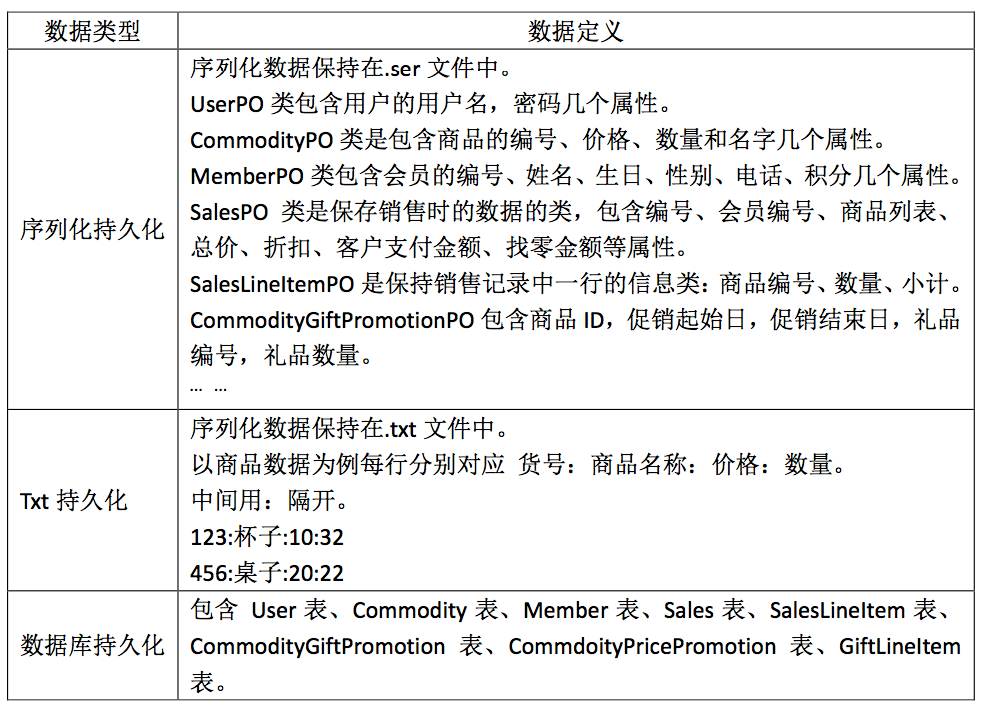

#### 构件接口

+ 规范

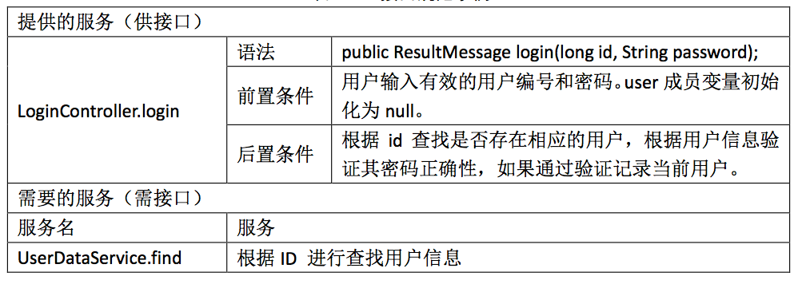

### 构建

+ 包创建
+ 重要⽂件的创建
+ 定义构件之间的接⼝
+ 关键需求的实现

### 集成与测试

#### 集成

+ 当体系结构中原型各个模块的代码都编写完成并经过单元测试之后,需要将所有模块组 合起来形成整个软件原型系统,这就是集成。集成的⽬的是为了逐步让各个模块合成为⼀个 系统来⼯作,从⽽验证整个系统的功能、性能、可靠性等需求。对于被集成起来的系统⼀般 主要是通过其暴露出来的接⼝,伪装⼀定的参数和输⼊,进⾏⿊盒测试。

+ ⼤爆炸式
+ 增量式
  + ⾃顶向下式
  + ⾃底向上式
  + 三明治式
  + 持续集成

#### 桩程序stub

+ 为了完成程序的编译和连接⽽使⽤的暂时代码
+ 对外模拟和代替承担模块接⼝的关键类
+ ⽐真实程序简单的多，使⽤最为简单的逻辑

#### 持续集成

+ 逐步编写各个模块内部程序，替换相应的桩程序
+ 真实程序不仅实现业务逻辑，⽽且会使⽤其他模块的接⼝程序（真实程序或者桩程序）
+ 每次替换之后都进⾏集成与测试

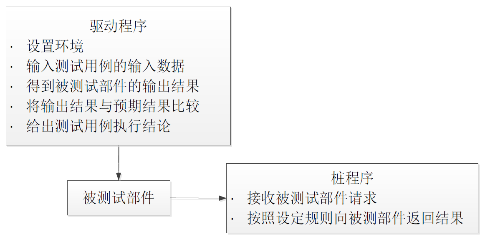

### 设计文档

### 评审

