# 项目开发

## 17 - 软件构造

### 概述

+ 通过编码、验证、单元测试、集成测试和调试等工作的结合，生产可工作的、有意义的软件的详细创建过程。

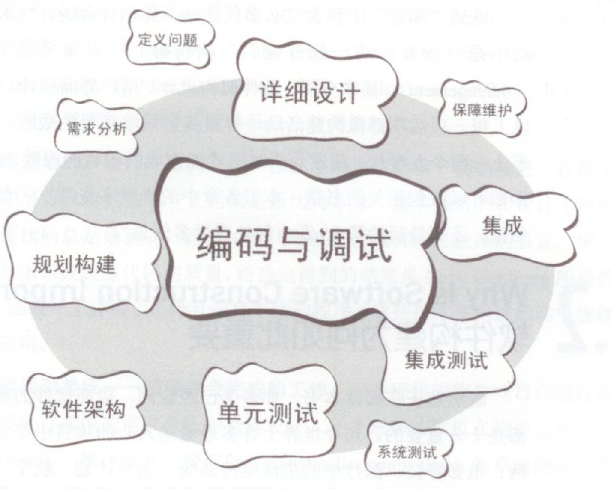

### 活动

+ 详细设计
+ 编程
+ 测试
+ 调试
+ 代码评审
+ 集成与构建(Build)
+ 构造管理

### 实践方法

#### 重构

+ 为什么要重构？
  + 1、因为无法预计到后续数年的修改，导致软件开发阶段的设计方案不能满足修改要求；
  + 2、随着修改次数的增多，软件设计结构的质量越来越脆弱，很难继续维持可修改性。

+ 什么是重构？
  + 修改软件系统的严谨方法，它在不改变代码外部表现的清况下改进其内部结构。

#### 测试驱动开发

+ 测试驱动开发要求程序员在编写一段代码之前，优先完成该段代码的测试代码。

#### 结对编程

+ 两个程序员坐一起，共同进行软件构造活动
+ 一人是驾驶员，负责输入代码。一人是观察员，负责评审代码。

## 18 - 代码设计

### 易读

#### 格式

+ 使用缩进与对齐表达逻辑结构
+ 将相关逻辑组织在一起
+ 使用空行分隔逻辑
+ 语句分行

#### 命名

+ 使用有意义的名称命名
+ 名称要与实际内容相符
+ 遵守惯例

#### 注释

+ 注释类型(Java)
  + 语句注释(//)
  + 标准注释(/* */)
  + 文档注释(/**  */)
+ Javadoc
  + @开头
  + 抽取成HTML格式文档

### 易维护

#### 小型任务

+ 要让程序代码可修改，就要控制代码的复杂度。这首先要求每个函数或方法的代码应该是内聚的，恰好完成一个功能与目标。
+ 如果内聚的代码本身比较简单，复杂性可控，那么它就具有比较好的可维护性。反之，内聚的代码也可以比较复杂，典型表现是完成一个功能需要多个步骤、代码比较长，那么就需要将其进一步分解为多个高内聚、低耦和的小型任务。

#### 复杂决策

+ 使用新的布尔变量简化复杂决策
  + 将小的布尔变量整合成新变量
+ 使用有意义的名称封装复杂决策
  + 对于决策“ If( (id>0) && (id<=MAX_ID))”I可以封装为“If ( isIdValid(id) )”I方法isIdValid(id)的内容为 “return 
    ((id>0) && (id<=MAX_ID) )”。
+ 表驱动编程

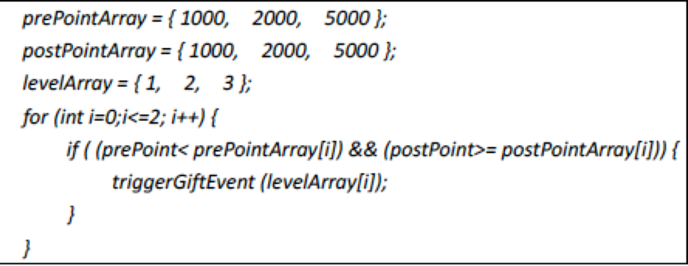

#### 数据使用

+ 不要变量复用
+ 减少全局变量

#### 明确依赖关系

+ 类之间模糊的依赖关系会影响到代码的理解与修改，非常容易导致修改时产生未预期的连锁反应。

### 可靠

#### 契约式设计

##### 异常方式

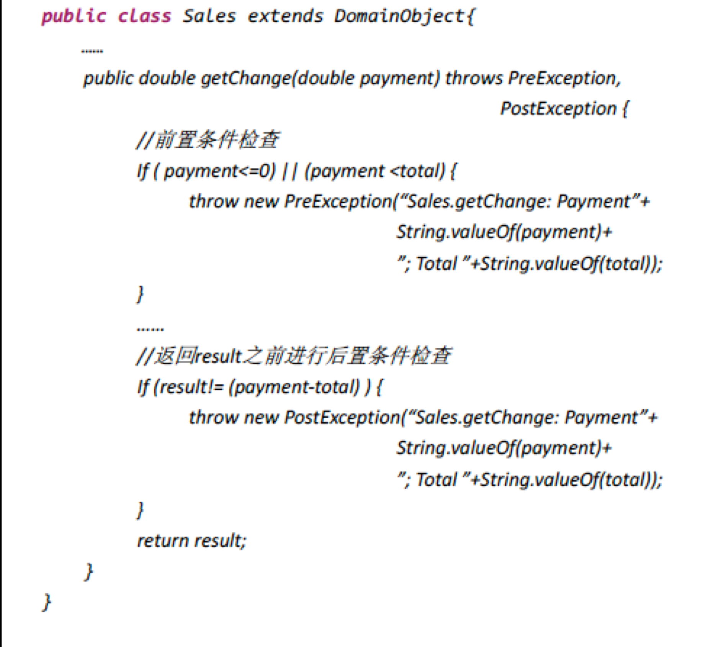

##### 断言方式

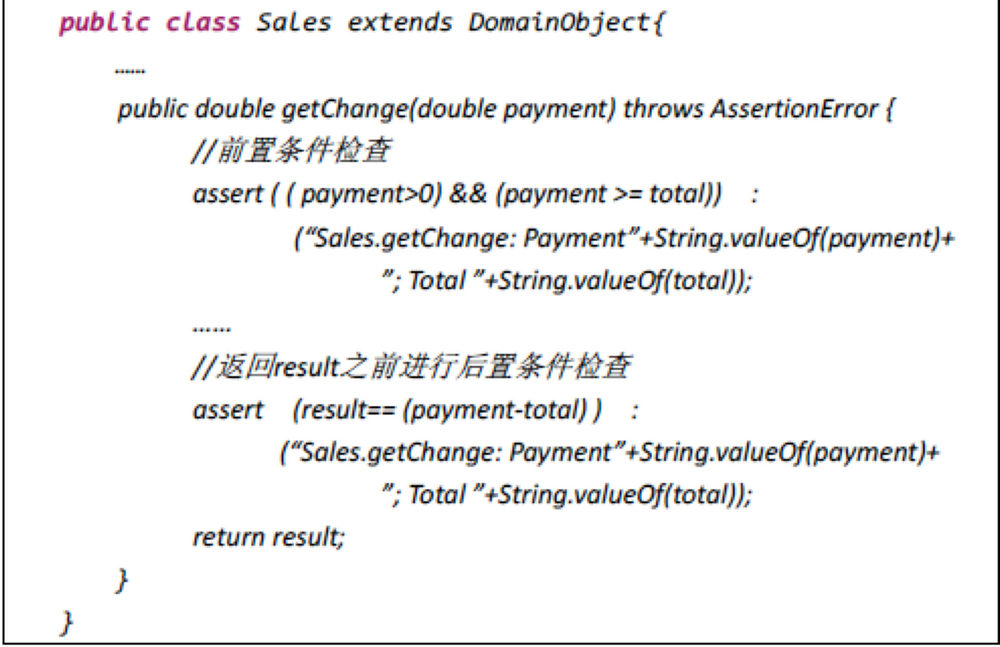

#### 防御式编程

+ 基本思想是：在一个方法与其他方法、操作系统、硬件等外界环境交互时，不能确保外界都是正确的，所以要在外界发生错误时，保护方法内部不受损害。

+ 常见场景
  + 输入参数是否合法？
  + 用户输入是否有效？
  + 外部文件是否存在？
  + 对其他对象的引用是否为NULL？
  + 其他对象是否已初始化？
  + 其他对象的某个方法是否已执行？
  + 其他对象的返回值是否正确？
  + 数据库系统连接是否正常？
  + 网络连接是否正常？
  + 网络接收的信息是否有效？

+ 异常和断言都可以用来实现防御式编程，两种实现方式的差异与契约式设计的实现一样。

### 设计模型

#### 决策表

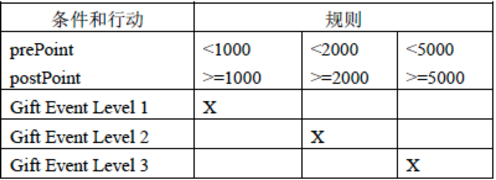

#### 伪代码

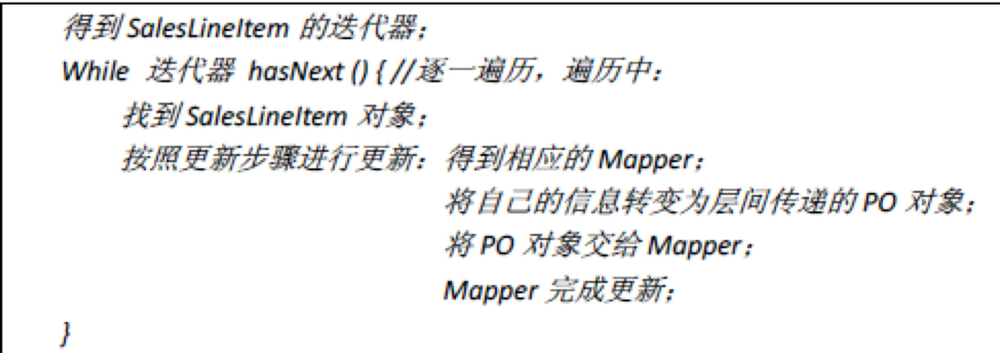

#### 程序流程图

### 单元测试

#### 方法测试

+ (1)方法的规格；
  + 根据第一种线索，可以使用基千规格的测试技术开发测试用例，等价类划分和边界值分析是开发单元测试用例常用的黑盒测试方法。

+ (2)方法代码的逻辑结构。
  + 根据第二种线索，可以使用基千代码的测试技术开发测试用例，对关键、复杂的代码使用路径覆盖，对复杂代码使用分支覆盖，简单情况使用语句覆盖。

#### 类测试

+ 在复杂类中，常常有着多变的状态，每次一个方法的执行改变了类状态时，都会给其他方法带来影响，也就是说复杂类的多个方法间是互相依赖的。

+ 所以，除了测试类的每一个方法之外，还测试类不同方法之间的互相影响清况。

## 19 - 软件测试

### 目的

+ 验证与确认
+ 有效性测试
+ 缺陷测试

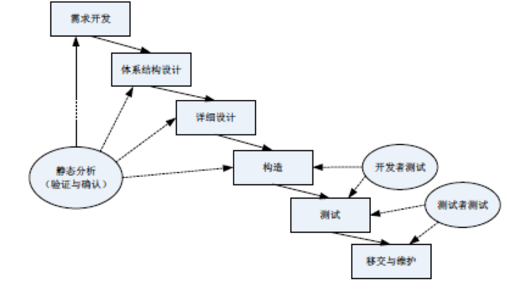

### 单元测试

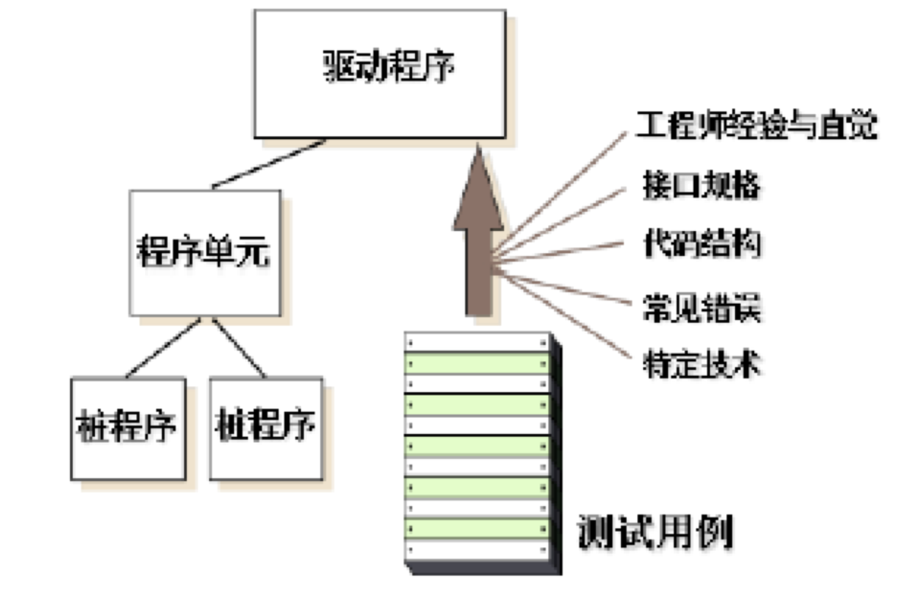

### 集成测试

#### 自顶向下

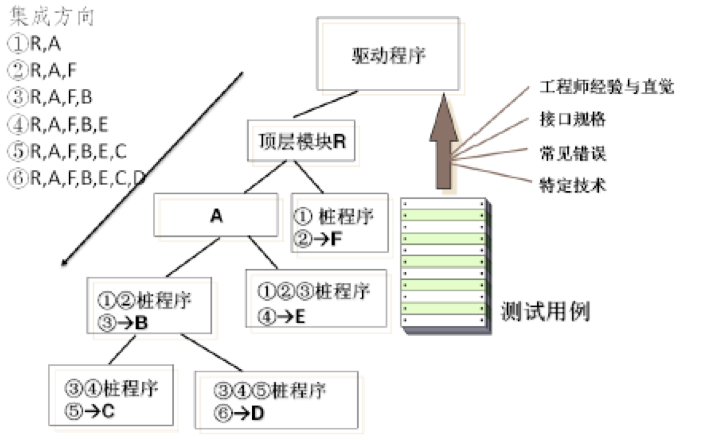

#### 自底向上

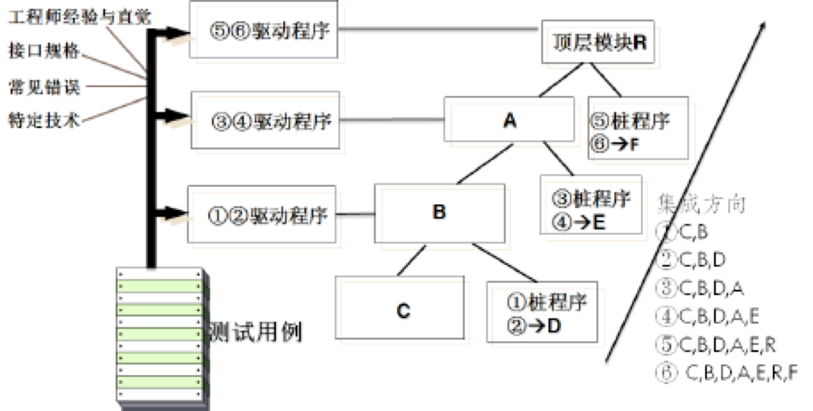

### 系统测试

+ 单元测试、集成测试更加关注技术上的正确性，重在发现设计缺陷和代码缺陷。系统测试则不同，它更关注不符合需求的缺陷和需求自身的内在缺陷。

+ 根据测试目标的不同，有很多不同类型的系统测试：功能测试、非功能性测试、验收测试、安装测试等等。但是发生在软件测试阶段，完全由软件测试人员控制和执行的主要是功能测试和非功能性测试。

+ 系统测试关注整个系统的行为，所以不依赖于桩程序和驱动程序。但是，使用一些测试工具可以让系统测试过程更加自动化。
+ 系统测试的功能测试计划以需求规格说明文档或用例文档为基础，主要使用随机测试和基于规格的测试技术设计功能测试用例。在测试非功能性需求时需要使用针对非功能需求的特定测试技术进行测试计划和测试用例设计。

### 随机测试

+ 随机测试（ 随机测试Ad hoc Testing)是一种 基于软件工程师直觉和经验的技术 ，也许是实践中使用最为广泛的测试技术。

+ 随机测试 根据软件工程师的技能、直觉和对类似程序的经验[Myers1979]，从所有可能的输入值中选择输入子集，建立测试用例。

### 黑盒测试

#### 等价类划分

+ 有效等价类：是指对于程序的规格说明来合理、意义输入数据构成集合。利用有效等价类可检验程序是否实现了规格说明中所定的功能和性能。

#### 边界值分析

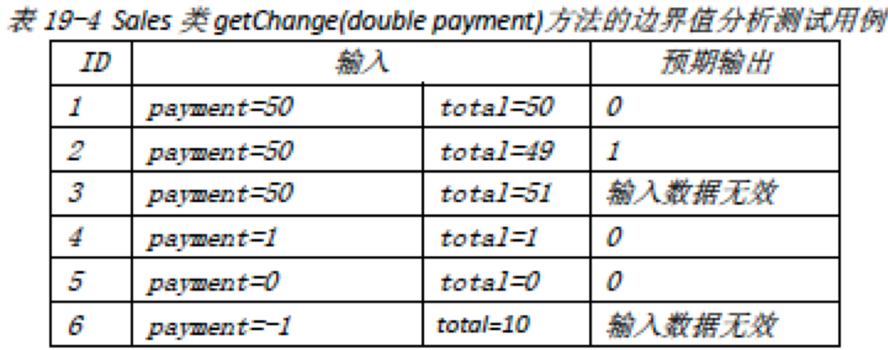

#### 决策表

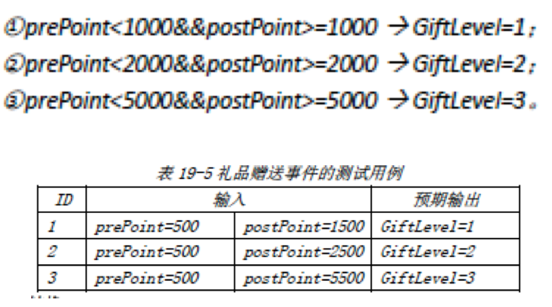

#### 状态转换

+ 同一对象状态不同，输出不同。

### 白盒测试

#### 语句覆盖

+ 语句覆盖设计测试用例的标准是确保被测试对象的每一行程序代码都至少执行一次。

#### 条件覆盖

+ 条件覆盖设计测试用例的标准是确保程序中每个判断的每个结果都至少满足一次

#### 路径覆盖

+ 路径覆盖测试用例的标准是确保程序中每条独立执行路径都至少执行一次

### 测试活动

+ 测试计划
+ 测试设计
+ 测试执行
+ 测试评价

### 测试度量

+ 缺陷数据

+ 测试覆盖率
  + 需求覆盖率
  + 模块覆盖律
  + 代码覆盖率

## 20 - 软件交付

### 安装

+ 确定安装环境
+ 列举安装清单
+ 设计和建立安装包
+ 测试安装包

### 部署

+ 确定部署环境
+ 确定部署任务
+ 完成部署准备
+ 执行部署任务

### 培训

+ 培训主要是教会用户使用软件产品的功能来完成其工作和任务。依据任务的不同，要为不同的用户进行不同类型的培训

### 文档支持

#### 用户文档

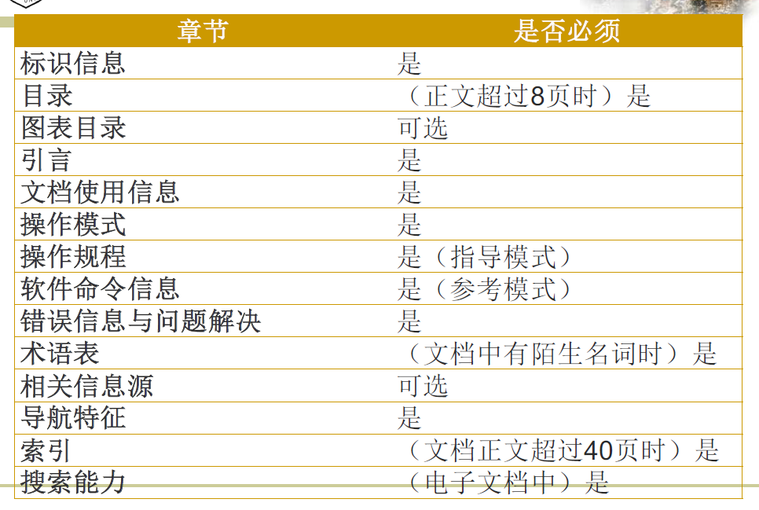

#### 系统管理员文档

+ 与用户文档注重系统使用细节不同，系统管理员文档更注重系统维护方面的内容，例如系统性能调整、访问权限控制、常见故障解决等等。因此，系统管理员文档需要详细介绍软硬件的配置方式、网络连接方式、安全验证与访问授权方法、备份与容灾方法、部件替换方法等等。

### 项目评价

+ 评审
  + 项目评审通过评审重要项目制品的方法来评价项目，这些重要制品包括项目计划、管理文档、会议记录、历史数据等。
  + 成功的评审需要评审方法，而不是自由处理。检查列表是最为常用的评审方法。
+ 度量数据分析
  + 度量数据可以提供丰富的信息，通过分析这些信息，开发团队可以获取正确和深入的结论。
  + 一个项目常见的产品信息度量应该包括：
    + （随着时间而变化的）产品的增长情况和变化历史。
    + 产品在每个里程碑上的测量。
    + 产品复杂度和内容的测量。
    + 过程和工具对产品的影响。

## 21 - 软件维护与演化

### 维护

+ 软件的维护主要是“修改”
  + 软件不会磨损
  + 软件维护只需要完成少量的使用帮助、故障解决和磨损处理等工作
  + 软件特性上是易于修改的
  + 软件只有持续修改才能保持价值

+ 完善性维护（Perfective maintenance）
+ 适应性维护（Adaptive maintenance）
+ 修正性维护（Corrective maintenance）
+ 预防性维护（Preventive maintenance）

### 维护过程

### 演化与维护

### 软件演化过程

#### 初始开发

+ 初始开发阶段按照传统的软件开发方式完成第一个版本的软件产品开发。第一版的软件产品可以实现全部需求，也可以（通常是）只包含部分需求——对用户来说非常重要和紧急的最高优先级需求。
+ 初始阶段的一个极其重要的工作是建立一个好的软件体系结构。
+ 在初始阶段的详细设计也要关注软件系统的可扩展性和可修改性，编程要关注程序的可读性以方便后续阶段的程序理解，技术文档的准备要充分以帮助后续阶段的程序理解。

#### 演化

+ 预先安排的需求增量；
+ 因为问题变化或者环境变化产生的变更请求；
+ 修正已有的缺陷；
+ 随着用户与开发者之间越来越相互熟悉对方领域而新增加的需求。

#### 服务

+ 服务阶段的软件产品不再持续的增加自己的价值，而只是周期性的修正已有的缺陷。
+ 一个软件产品被置于服务阶段可能是因为它的软件结构已经无法继续演化，也可能是开发团队出于市场考虑，不再重点关注该产品。

+ 服务阶段的产品还仍然被用户使用，因为它仍然能够给用户提供一定的业务价值，所以开发团队仍然需要修正已有缺陷或者进行一些低程度的需求增量，保证用户的正常使用。

#### 逐步淘汰

+ 在逐步淘汰阶段，开发者已经不再提供软件产品的任何服务，也即不再继续维护该软件。
+ 虽然在开发者看来软件的生命周期已经结束，但是用户可能会继续使用处于该阶段的软件产品，因为它们仍然能够帮助用户实现一定的业务价值。只是用户在使用软件时必须要容忍软件产品中的各种不便，包括仍然存在的缺陷和对新环境的不适应。

#### 停止

+ 一个软件正式退出使用状态之后就进行停止状态。开发者不再进行维护，用户也不再使用。

### 遗留软件

+ 如果遗留软件已经没有使用价值，就直接丢弃该软件。
+ 如果遗留软件还有使用价值，但是其维护的成本效益比低于新开发一个软件系统的成本效益比，那么冻结遗留软件，将其作为一个新的更大系统的组成部分进行使用。
+ 如果遗留软件的成本效益比低于新开发一个软件系统的成本效益比，而且该遗留软件仍然具备较好的可维护性，那么就逆向工程遗留软件并继续维护一段时间；
+ 如果遗留软件的成本效益比高于新开发一个软件系统的成本效益比，而且该遗留软件已经不具备可维护性，那么就修改系统使其获得新生（即再工程该系统），然后继续维护再造后的系统。

### 逆向工程

+ 处理遗留软件时，维护人员接受的维护对象可能是一个没有任何文档也没有程序源代码的软件程序，此时，维护人员需要使用逆向工程技术
+ 逆向工程技术是指：“分析目标系统，标识系统的部件及其交互关系，并且使用其它形式或者更高层的抽象创建系统表现的过程[Chikofsky1990]”。
+ 逆向工程的基本原理是抽取软件系统的需求与设计而隐藏实现细节，然后在需求与设计的层次上描述软件系统，以建立对系统更加准确和清晰的理解。
+ 其主要目的是在不能轻易获得必要的生产信息的情况下，直接从成品分析，推导出产品的设计原理。

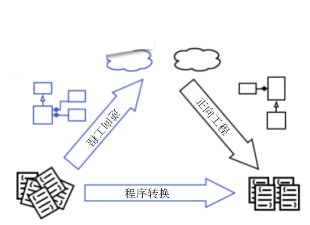

### 再工程

+ 再工程的目的是对遗留软件系统进行分析和重新开发，以便进一步利用新技术来改善系统或促进现存系统的再利用。[Chikofsky1990]将再工程定义为：检查和改造一个目标系统，用新的模式及其实现复原该目标系统。
+ 逆向工程的关注点在于理解软件，而不修改软件。而再工程是洽恰相反的，再工程关注如何修改软件，不会花费很大力气来理解软件。所以，在处理遗留软件时，再工程之前通常都需要有前导的逆向工程

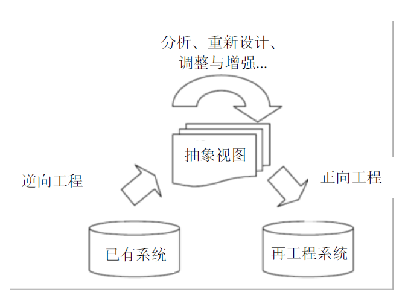

